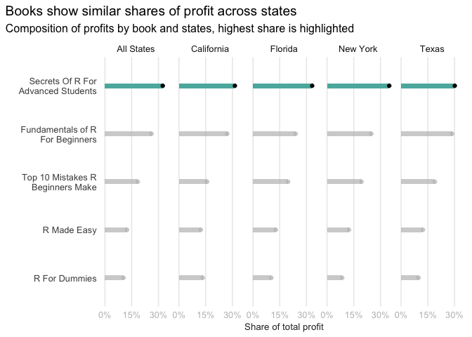

# Getting familiar with the data

*It's easy to lose context when we're just talking about data analysis in general. The first thing we should do before we do any analysis is to get acquainted with our dataset. There are many, many things to check with a dataset before we dive into any analysis. How much data is there? What kind of data do we actually have on hand? Is there anything "weird" that might interfere with any analyses we might need to do? Is there missing data? Answering these questions now saves we time and effort later.*

*If we don't check the data beforehand, it's easy to make some false assumptions about the data that can hinder our progress later. Maybe we think that one column looks like a number, but it's actually been read in as a string. Perhaps some things were misspelled. In any case, getting familiar with the data is our first step in the data analysis workflow. Here's a few helpful questions to start out any data analysis. Answer each of these questions for the sales dataset. (instructions from the course are always in italic)*

## Instructions

### 1. How big is the dataset?

::: {.instruction-notes}
-   Recall we can use the [`dim()` function](https://stat.ethz.ch/R-manual/R-devel/library/base/html/dim.html) to see how many rows and columns are in a tibble.
-   You should take a note of how many columns there are and how many rows there are.
-   Write some notes to ourself to keep track of what we see in the dataset.
:::

::: {.solution-text}
There are **2000 rows** and **4 columns/variables** in the data
:::

### 2. What are the column names?

::: {.instruction-notes}
-   Recall we can use the [\`colnames()\` function](https://stat.ethz.ch/R-manual/R-devel/library/base/html/colnames.html) to return each of the column names of a tibble in a vector.\
-   What do each of the columns seem to represent?
:::

::: {.solution-text}
The names of the columns are: **book, review, state, price**
:::

### 3. What are the *types* of each of the columns? {.tabset}

::: {.instruction-notes}
-   Sometimes you may find that data will look one way, but is actually disguised as another. As mentioned above, a common example of this is numbers that are actually strings in the data!\
-   You can use the [`typeof()` function](https://stat.ethz.ch/R-manual/R-devel/library/base/html/typeof.html) to learn what the type is for each column.\
-   This would be a good application of a `for` loop. Since we have the column names from `colnames()`, we can loop through these and check the types of each of the column. Recall that you can access a column in a tibble with double bracket syntax `tibble_data[["column_name"]]` where `tibble_data` is a tibble and `column_name` is a string with the column name. Combining this with `typeof()` will give you back the type of the column itself.
:::

#### for loop + print

Here, the class.output option does not work, because we set the results to 'asis'. In the ouput, the code is therefore within the green box, rather than above it. As a work around, I copied the code and once it is not evaluated (eval = FALSE). When it is evaluated, it will not show the code echo = FALSE).

Helpful here: the [results = 'asis'](#%20https://bookdown.org/yihui/rmarkdown-cookbook/results-asis.html) function.


```r
for (var in seq_along(reviews_df)) {
      
  var_type <- typeof(reviews_df[[var]])
  names(var_type) <- names(reviews_df[var])
  
  var_type %>% glue_data("- `{names(.)}`: {.}") %>% print()
  # var_type %>% cat(labels = paste0("- `", names(.), "`: "),
  #     fill = TRUE,
  #     append = TRUE)
}
```

::: {.solution-text}
**Variables and their unique types:**

- `book`: character
- `review`: character
- `state`: character
- `price`: double
:::

#### map


```r
reviews_df %>% 
  map_chr(typeof) %>%
  as_tibble(rownames = "column") %>% 
  flextable() %>% 
  theme_alafoli()
```

```{=html}
<template id="8abe593d-7f06-4697-a8a5-878ab5a818c9"><style>
.tabwid table{
  border-collapse:collapse;
  line-height:1;
  margin-left:auto;
  margin-right:auto;
  border-width: 0;
  display: table;
  margin-top: 1.275em;
  margin-bottom: 1.275em;
  border-spacing: 0;
  border-color: transparent;
}
.tabwid_left table{
  margin-left:0;
}
.tabwid_right table{
  margin-right:0;
}
.tabwid td {
    padding: 0;
}
.tabwid a {
  text-decoration: none;
}
.tabwid thead {
    background-color: transparent;
}
.tabwid tfoot {
    background-color: transparent;
}
.tabwid table tr {
background-color: transparent;
}
</style><div class="tabwid"><style>.cl-05f1f660{border-collapse:collapse;}.cl-05e6a22e{font-family:'Helvetica';font-size:11pt;font-weight:normal;font-style:normal;text-decoration:none;color:rgba(102, 102, 102, 1.00);background-color:transparent;}.cl-05e6dab4{margin:0;text-align:left;border-bottom: 0 solid rgba(0, 0, 0, 1.00);border-top: 0 solid rgba(0, 0, 0, 1.00);border-left: 0 solid rgba(0, 0, 0, 1.00);border-right: 0 solid rgba(0, 0, 0, 1.00);padding-bottom:3pt;padding-top:3pt;padding-left:3pt;padding-right:3pt;line-height: 1;background-color:transparent;}.cl-05e74e2c{width:54pt;background-color:transparent;vertical-align: middle;border-bottom: 0 solid rgba(0, 0, 0, 1.00);border-top: 0 solid rgba(0, 0, 0, 1.00);border-left: 0 solid rgba(0, 0, 0, 1.00);border-right: 0 solid rgba(0, 0, 0, 1.00);margin-bottom:0;margin-top:0;margin-left:0;margin-right:0;}.cl-05e74e68{width:54pt;background-color:transparent;vertical-align: middle;border-bottom: 1pt solid rgba(102, 102, 102, 1.00);border-top: 0 solid rgba(0, 0, 0, 1.00);border-left: 0 solid rgba(0, 0, 0, 1.00);border-right: 0 solid rgba(0, 0, 0, 1.00);margin-bottom:0;margin-top:0;margin-left:0;margin-right:0;}</style><table class='cl-05f1f660'><thead><tr style="overflow-wrap:break-word;"><td class="cl-05e74e68"><p class="cl-05e6dab4"><span class="cl-05e6a22e">column</span></p></td><td class="cl-05e74e68"><p class="cl-05e6dab4"><span class="cl-05e6a22e">value</span></p></td></tr></thead><tbody><tr style="overflow-wrap:break-word;"><td class="cl-05e74e2c"><p class="cl-05e6dab4"><span class="cl-05e6a22e">book</span></p></td><td class="cl-05e74e2c"><p class="cl-05e6dab4"><span class="cl-05e6a22e">character</span></p></td></tr><tr style="overflow-wrap:break-word;"><td class="cl-05e74e2c"><p class="cl-05e6dab4"><span class="cl-05e6a22e">review</span></p></td><td class="cl-05e74e2c"><p class="cl-05e6dab4"><span class="cl-05e6a22e">character</span></p></td></tr><tr style="overflow-wrap:break-word;"><td class="cl-05e74e2c"><p class="cl-05e6dab4"><span class="cl-05e6a22e">state</span></p></td><td class="cl-05e74e2c"><p class="cl-05e6dab4"><span class="cl-05e6a22e">character</span></p></td></tr><tr style="overflow-wrap:break-word;"><td class="cl-05e74e2c"><p class="cl-05e6dab4"><span class="cl-05e6a22e">price</span></p></td><td class="cl-05e74e2c"><p class="cl-05e6dab4"><span class="cl-05e6a22e">double</span></p></td></tr></tbody></table></div></template>
<div class="flextable-shadow-host" id="e658a7d7-f1e9-4667-b8af-3355e113cdc7"></div>
<script>
var dest = document.getElementById("e658a7d7-f1e9-4667-b8af-3355e113cdc7");
var template = document.getElementById("8abe593d-7f06-4697-a8a5-878ab5a818c9");
var caption = template.content.querySelector("caption");
if(caption) {
  caption.style.cssText = "display:block;text-align:center;";
  var newcapt = document.createElement("p");
  newcapt.appendChild(caption)
  dest.parentNode.insertBefore(newcapt, dest.previousSibling);
}
var fantome = dest.attachShadow({mode: 'open'});
var templateContent = template.content;
fantome.appendChild(templateContent);
</script>

```

```r
# reviews_df %>% map_df(typeof) %>% 
#       pivot_longer(cols = everything(), 
#                    names_to = "column", 
#                    values_to = "type")
```

### 4. What are the unique values present in each of the columns? {.tabset}

::: {.instruction-notes}
-   The If we're dealing with numbers, it's good to get a sense of how high and how low the values go. If we're dealing with strings, it's good to see all of the different possible values that are there.
:::

-   We want to print the columns and all the unique values per column
-   We can use glue, which makes it possible to add the "and" before the last element

#### for loop + print


```r
for (var in seq_along(reviews_df)) {
  
  unique_values <- reviews_df[[var]] %>%
    unique() %>% 
    glue_collapse(sep = ", ", last = ", and ")
  
  names(unique_values) <- names(reviews_df[var])
     
  unique_values %>%
    glue_data("- `{names(.)}`: {.}") %>% print()
  # unique_values %>% cat(labels = paste0("- `", names(.), "`: "),
  #     fill = TRUE,
  #     append = TRUE)
} 
```

::: {.solution-text}
**Variables and their unique values:**

- `book`: R Made Easy, R For Dummies, Secrets Of R For Advanced Students, Top 10 Mistakes R Beginners Make, and Fundamentals of R For Beginners
- `review`: Excellent, Fair, Poor, Great, and Good
- `state`: TX, NY, FL, Texas, California, Florida, CA, and New York
- `price`: 19.99, 15.99, 50, 29.99, and 39.99
:::

#### predefined for loop

[how to set names to a list in loop](https://stackoverflow.com/questions/24659680/naming-list-items-via-loop-in-r)


```r
list_unique_values <- vector(mode = "list", length = ncol(reviews_df))
names(list_unique_values) <- colnames(reviews_df)

for (var in seq_along(reviews_df)) {
  list_unique_values[[var]] <- reviews_df[[var]] %>% unique() %>% na.omit()
  # don't like this line to get rid of NA values
  # list_unique_values[[var]] <- list_unique_values[[var]][!is.na(list_unique_values[[var]])]
} 

list_unique_values %>% 
  map(~glue_collapse(.x, sep = ", ", last = ", and ")) %>%
  glue_data("- `{names(.)}`: {.}") 
```

- `book`: R Made Easy, R For Dummies, Secrets Of R For Advanced Students, Top 10 Mistakes R Beginners Make, and Fundamentals of R For Beginners
- `review`: Excellent, Fair, Poor, Great, and Good
- `state`: TX, NY, FL, Texas, California, Florida, CA, and New York
- `price`: 19.99, 15.99, 50, 29.99, and 39.99

#### iwalk


```r
cat_description <- function(myvector, vec_names){
  cat("- `", vec_names, "`: ", 
      paste0(unique(myvector), sep = ", "), " \n", sep = "")
}

reviews_df %>% iwalk(cat_description)
```

- `book`: R Made Easy, R For Dummies, Secrets Of R For Advanced Students, Top 10 Mistakes R Beginners Make, Fundamentals of R For Beginners,  
- `review`: Excellent, Fair, Poor, Great, NA, Good,  
- `state`: TX, NY, FL, Texas, California, Florida, CA, New York,  
- `price`: 19.99, 15.99, 50, 29.99, 39.99,  

#### map

Approach 1 is to print a tibble


```r
reviews_df %>% 
  map_chr(~glue_collapse(unique(.x) %>% na.omit(), sep = ", ", last = ", and ")) %>% 
  as_tibble(rownames = "column") %>% 
  flextable() %>% 
  theme_alafoli() %>% 
  autofit()
```

```{=html}
<template id="55c3a426-708e-4b97-90a3-41f7a52e6e2a"><style>
.tabwid table{
  border-collapse:collapse;
  line-height:1;
  margin-left:auto;
  margin-right:auto;
  border-width: 0;
  display: table;
  margin-top: 1.275em;
  margin-bottom: 1.275em;
  border-spacing: 0;
  border-color: transparent;
}
.tabwid_left table{
  margin-left:0;
}
.tabwid_right table{
  margin-right:0;
}
.tabwid td {
    padding: 0;
}
.tabwid a {
  text-decoration: none;
}
.tabwid thead {
    background-color: transparent;
}
.tabwid tfoot {
    background-color: transparent;
}
.tabwid table tr {
background-color: transparent;
}
</style><div class="tabwid"><style>.cl-064e685a{border-collapse:collapse;}.cl-0643d688{font-family:'Helvetica';font-size:11pt;font-weight:normal;font-style:normal;text-decoration:none;color:rgba(102, 102, 102, 1.00);background-color:transparent;}.cl-0643e9c0{margin:0;text-align:left;border-bottom: 0 solid rgba(0, 0, 0, 1.00);border-top: 0 solid rgba(0, 0, 0, 1.00);border-left: 0 solid rgba(0, 0, 0, 1.00);border-right: 0 solid rgba(0, 0, 0, 1.00);padding-bottom:3pt;padding-top:3pt;padding-left:3pt;padding-right:3pt;line-height: 1;background-color:transparent;}.cl-064417ec{width:724.4pt;background-color:transparent;vertical-align: middle;border-bottom: 0 solid rgba(0, 0, 0, 1.00);border-top: 0 solid rgba(0, 0, 0, 1.00);border-left: 0 solid rgba(0, 0, 0, 1.00);border-right: 0 solid rgba(0, 0, 0, 1.00);margin-bottom:0;margin-top:0;margin-left:0;margin-right:0;}.cl-0644180a{width:50.7pt;background-color:transparent;vertical-align: middle;border-bottom: 0 solid rgba(0, 0, 0, 1.00);border-top: 0 solid rgba(0, 0, 0, 1.00);border-left: 0 solid rgba(0, 0, 0, 1.00);border-right: 0 solid rgba(0, 0, 0, 1.00);margin-bottom:0;margin-top:0;margin-left:0;margin-right:0;}.cl-06441814{width:724.4pt;background-color:transparent;vertical-align: middle;border-bottom: 0 solid rgba(0, 0, 0, 1.00);border-top: 0 solid rgba(0, 0, 0, 1.00);border-left: 0 solid rgba(0, 0, 0, 1.00);border-right: 0 solid rgba(0, 0, 0, 1.00);margin-bottom:0;margin-top:0;margin-left:0;margin-right:0;}.cl-0644181e{width:50.7pt;background-color:transparent;vertical-align: middle;border-bottom: 0 solid rgba(0, 0, 0, 1.00);border-top: 0 solid rgba(0, 0, 0, 1.00);border-left: 0 solid rgba(0, 0, 0, 1.00);border-right: 0 solid rgba(0, 0, 0, 1.00);margin-bottom:0;margin-top:0;margin-left:0;margin-right:0;}.cl-06441828{width:50.7pt;background-color:transparent;vertical-align: middle;border-bottom: 0 solid rgba(0, 0, 0, 1.00);border-top: 0 solid rgba(0, 0, 0, 1.00);border-left: 0 solid rgba(0, 0, 0, 1.00);border-right: 0 solid rgba(0, 0, 0, 1.00);margin-bottom:0;margin-top:0;margin-left:0;margin-right:0;}.cl-06441832{width:724.4pt;background-color:transparent;vertical-align: middle;border-bottom: 0 solid rgba(0, 0, 0, 1.00);border-top: 0 solid rgba(0, 0, 0, 1.00);border-left: 0 solid rgba(0, 0, 0, 1.00);border-right: 0 solid rgba(0, 0, 0, 1.00);margin-bottom:0;margin-top:0;margin-left:0;margin-right:0;}.cl-06441833{width:50.7pt;background-color:transparent;vertical-align: middle;border-bottom: 1pt solid rgba(102, 102, 102, 1.00);border-top: 0 solid rgba(0, 0, 0, 1.00);border-left: 0 solid rgba(0, 0, 0, 1.00);border-right: 0 solid rgba(0, 0, 0, 1.00);margin-bottom:0;margin-top:0;margin-left:0;margin-right:0;}.cl-0644183c{width:724.4pt;background-color:transparent;vertical-align: middle;border-bottom: 1pt solid rgba(102, 102, 102, 1.00);border-top: 0 solid rgba(0, 0, 0, 1.00);border-left: 0 solid rgba(0, 0, 0, 1.00);border-right: 0 solid rgba(0, 0, 0, 1.00);margin-bottom:0;margin-top:0;margin-left:0;margin-right:0;}</style><table class='cl-064e685a'><thead><tr style="overflow-wrap:break-word;"><td class="cl-06441833"><p class="cl-0643e9c0"><span class="cl-0643d688">column</span></p></td><td class="cl-0644183c"><p class="cl-0643e9c0"><span class="cl-0643d688">value</span></p></td></tr></thead><tbody><tr style="overflow-wrap:break-word;"><td class="cl-0644180a"><p class="cl-0643e9c0"><span class="cl-0643d688">book</span></p></td><td class="cl-064417ec"><p class="cl-0643e9c0"><span class="cl-0643d688">R Made Easy, R For Dummies, Secrets Of R For Advanced Students, Top 10 Mistakes R Beginners Make, and Fundamentals of R For Beginners</span></p></td></tr><tr style="overflow-wrap:break-word;"><td class="cl-0644181e"><p class="cl-0643e9c0"><span class="cl-0643d688">review</span></p></td><td class="cl-06441814"><p class="cl-0643e9c0"><span class="cl-0643d688">Excellent, Fair, Poor, Great, and Good</span></p></td></tr><tr style="overflow-wrap:break-word;"><td class="cl-0644181e"><p class="cl-0643e9c0"><span class="cl-0643d688">state</span></p></td><td class="cl-06441814"><p class="cl-0643e9c0"><span class="cl-0643d688">TX, NY, FL, Texas, California, Florida, CA, and New York</span></p></td></tr><tr style="overflow-wrap:break-word;"><td class="cl-06441828"><p class="cl-0643e9c0"><span class="cl-0643d688">price</span></p></td><td class="cl-06441832"><p class="cl-0643e9c0"><span class="cl-0643d688">19.99, 15.99, 50, 29.99, and 39.99</span></p></td></tr></tbody></table></div></template>
<div class="flextable-shadow-host" id="c2d32f42-d996-4e6f-a233-66003f2b8c8b"></div>
<script>
var dest = document.getElementById("c2d32f42-d996-4e6f-a233-66003f2b8c8b");
var template = document.getElementById("55c3a426-708e-4b97-90a3-41f7a52e6e2a");
var caption = template.content.querySelector("caption");
if(caption) {
  caption.style.cssText = "display:block;text-align:center;";
  var newcapt = document.createElement("p");
  newcapt.appendChild(caption)
  dest.parentNode.insertBefore(newcapt, dest.previousSibling);
}
var fantome = dest.attachShadow({mode: 'open'});
var templateContent = template.content;
fantome.appendChild(templateContent);
</script>

```

Approach 2 is to use glue_data to print each row in the fomat we specify


```r
reviews_df %>% 
  map(~glue_collapse(unique(.x) %>% na.omit(), sep = ", ", last = ", and ")) %>% 
  glue_data("- Column `{names(.)}` unique values: {.}.")
```

- Column `book` unique values: R Made Easy, R For Dummies, Secrets Of R For Advanced Students, Top 10 Mistakes R Beginners Make, and Fundamentals of R For Beginners.
- Column `review` unique values: Excellent, Fair, Poor, Great, and Good.
- Column `state` unique values: TX, NY, FL, Texas, California, Florida, CA, and New York.
- Column `price` unique values: 19.99, 15.99, 50, 29.99, and 39.99.

# Handling Missing Data

*Now that we are more familiar with the data itself, now we can get into the more specific details of data analysis. A large part of a data analyst's job is to take a raw dataset and turn it into a form that we can use for analysis. Many times, we will not be able to just take a dataset and start analyzing it. It's good practice to examine the data beforehand and make note of any changes we need to make for it. This process has many names, but for future reference, we'll call it data cleaning or data processing.*

*The first issue we will contend with is the issue of missing data. Missing data is annoying because there's nothing we can really do with it. We can't perform any analysis or calculations with missing data. In R, missing data is typically shown with NA, which stands for "not available". Some other datasets may convey non-existence in a different way, but NA is the most common.*

*There are two ways that we can deal with missing data: 1) remove any rows or columns that have missing data (typically, rows) or 2) fill in the missing data in an informed, discipline way. This second way is known as imputation, and it's outside of the scope of what we've learned so far. For now, we'll take first approach with this dataset.*

## Instructions

### 1. Examine the data and get an understanding of which columns have data missing. {.tabset}

::: {.instruction-notes}
-   Since we're going to check through each of the columns, a `for` loop would be useful in this case.
:::

#### for loop + kable

::: {.solution-text}

```r
n_missings <- vector(mode = "logical", length = ncol(reviews_df))
names(n_missings) <- colnames(reviews_df)      

for (var in seq_along(reviews_df)) {
  n_missings[var] <- sum(is.na(reviews_df[[var]]))
} 

n_missings %>%
  kableExtra::kbl(col.names = "Number of missing values") %>% 
  kableExtra::kable_minimal(full_width = F)
```

<table class=" lightable-minimal" style='font-family: "Trebuchet MS", verdana, sans-serif; width: auto !important; margin-left: auto; margin-right: auto;'>
 <thead>
  <tr>
   <th style="text-align:left;">   </th>
   <th style="text-align:right;"> Number of missing values </th>
  </tr>
 </thead>
<tbody>
  <tr>
   <td style="text-align:left;"> book </td>
   <td style="text-align:right;"> 0 </td>
  </tr>
  <tr>
   <td style="text-align:left;"> review </td>
   <td style="text-align:right;"> 206 </td>
  </tr>
  <tr>
   <td style="text-align:left;"> state </td>
   <td style="text-align:right;"> 0 </td>
  </tr>
  <tr>
   <td style="text-align:left;"> price </td>
   <td style="text-align:right;"> 0 </td>
  </tr>
</tbody>
</table>
:::

#### map+kable

::: {.solution-text}

```r
reviews_df %>% 
  map_chr(~any(is.na(.x))) %>% 
  kableExtra::kbl(col.names = "Is Missing?") %>% 
  kableExtra::kable_minimal(full_width = F)
```

<table class=" lightable-minimal" style='font-family: "Trebuchet MS", verdana, sans-serif; width: auto !important; margin-left: auto; margin-right: auto;'>
 <thead>
  <tr>
   <th style="text-align:left;">   </th>
   <th style="text-align:left;"> Is Missing? </th>
  </tr>
 </thead>
<tbody>
  <tr>
   <td style="text-align:left;"> book </td>
   <td style="text-align:left;"> FALSE </td>
  </tr>
  <tr>
   <td style="text-align:left;"> review </td>
   <td style="text-align:left;"> TRUE </td>
  </tr>
  <tr>
   <td style="text-align:left;"> state </td>
   <td style="text-align:left;"> FALSE </td>
  </tr>
  <tr>
   <td style="text-align:left;"> price </td>
   <td style="text-align:left;"> FALSE </td>
  </tr>
</tbody>
</table>


```r
reviews_df %>% 
  map_chr(~sum(is.na(.x))) %>% 
  kableExtra::kbl(col.names = "Number of missing values") %>% 
  kableExtra::kable_minimal(full_width = F)
```

<table class=" lightable-minimal" style='font-family: "Trebuchet MS", verdana, sans-serif; width: auto !important; margin-left: auto; margin-right: auto;'>
 <thead>
  <tr>
   <th style="text-align:left;">   </th>
   <th style="text-align:left;"> Number of missing values </th>
  </tr>
 </thead>
<tbody>
  <tr>
   <td style="text-align:left;"> book </td>
   <td style="text-align:left;"> 0 </td>
  </tr>
  <tr>
   <td style="text-align:left;"> review </td>
   <td style="text-align:left;"> 206 </td>
  </tr>
  <tr>
   <td style="text-align:left;"> state </td>
   <td style="text-align:left;"> 0 </td>
  </tr>
  <tr>
   <td style="text-align:left;"> price </td>
   <td style="text-align:left;"> 0 </td>
  </tr>
</tbody>
</table>
:::

### 2. Subset Data

*Create a new copy of the dataset that removes all of the rows that have missing data.*

::: {.instruction-notes}
-   Here, you should try to apply the `filter()` and `is.na()` functions to get to this new dataset without missing values.
:::

In the previous section, we found out that there are only missings in the review column. Instead of dropping those rows, we can add a flag that indicated whether there are missings in the row or not. This allows us to use all of the information for questions that do not involve the reviews, and also to compare which books do not have reviews (and why?).


```r
reviews_meta <- reviews_df %>% 
  rowid_to_column(var = "id") %>% 
  mutate(is_complete = rowSums(is.na(.)) == 0)
```

### 3. Inspect Data

*Make a note to ourself on the dimensions of the new dataset. How much data was removed by taking out the rows with missing data?*

::: {.instruction-notes}
-   There's no explicitly correct answer for this, but do we think that removing that much data will affect the findings of any calculations we end up doing? It's important to keep questions like this in mind as we clean our data.
:::

The new dataset has 206 rows less

::: {.solution-text}

```r
reviews_meta %>% tabyl(is_complete)
```


<table>
 <thead>
  <tr>
   <th style="text-align:left;"> is_complete </th>
   <th style="text-align:right;"> n </th>
   <th style="text-align:right;"> percent </th>
  </tr>
 </thead>
<tbody>
  <tr>
   <td style="text-align:left;"> FALSE </td>
   <td style="text-align:right;"> 206 </td>
   <td style="text-align:right;"> 0.103 </td>
  </tr>
  <tr>
   <td style="text-align:left;"> TRUE </td>
   <td style="text-align:right;"> 1794 </td>
   <td style="text-align:right;"> 0.897 </td>
  </tr>
</tbody>
</table>
:::

<br>

-   Is there any book with exceptionally high percentage of missings? *--No*

::: {.solution-text}

```r
reviews_meta %>% 
  tabyl(book, is_complete) %>% 
  adorn_percentages() %>% 
  adorn_rounding(2) %>% 
  adorn_title()
```


<table>
 <thead>
  <tr>
   <th style="text-align:left;">  </th>
   <th style="text-align:left;"> is_complete </th>
   <th style="text-align:left;">  </th>
  </tr>
 </thead>
<tbody>
  <tr>
   <td style="text-align:left;"> book </td>
   <td style="text-align:left;"> FALSE </td>
   <td style="text-align:left;"> TRUE </td>
  </tr>
  <tr>
   <td style="text-align:left;"> Fundamentals of R For Beginners </td>
   <td style="text-align:left;"> 0.11 </td>
   <td style="text-align:left;"> 0.89 </td>
  </tr>
  <tr>
   <td style="text-align:left;"> R For Dummies </td>
   <td style="text-align:left;"> 0.12 </td>
   <td style="text-align:left;"> 0.88 </td>
  </tr>
  <tr>
   <td style="text-align:left;"> R Made Easy </td>
   <td style="text-align:left;"> 0.1 </td>
   <td style="text-align:left;"> 0.9 </td>
  </tr>
  <tr>
   <td style="text-align:left;"> Secrets Of R For Advanced Students </td>
   <td style="text-align:left;"> 0.11 </td>
   <td style="text-align:left;"> 0.89 </td>
  </tr>
  <tr>
   <td style="text-align:left;"> Top 10 Mistakes R Beginners Make </td>
   <td style="text-align:left;"> 0.08 </td>
   <td style="text-align:left;"> 0.92 </td>
  </tr>
</tbody>
</table>
:::

<br>

-   Is there any state with exceptionally high percentage of missings? *--No*


```r
reviews_meta %>% 
  select(-review) %>% 
  dplyr::mutate_if(is.numeric, as.character) %>% 
  pivot_longer(-c(id, is_complete)) %>% 
  tabyl(value, is_complete, name, show_missing_levels = FALSE) %>% 
  adorn_percentages() %>% 
  adorn_rounding(2) %>% 
  adorn_title() %>% 
  kbl() %>% 
  kable_styling(bootstrap_options = c("striped", "hover", "condensed", "responsive"), 
                full_width = F, font_size = 14, position = "left")
```

<table class="kable_wrapper table table-striped table-hover table-condensed table-responsive" style="font-size: 14px; width: auto !important; ">
<tbody>
  <tr>
   <td> 

<table>
 <thead>
  <tr>
   <th style="text-align:left;">  </th>
   <th style="text-align:left;"> is_complete </th>
   <th style="text-align:left;">  </th>
  </tr>
 </thead>
<tbody>
  <tr>
   <td style="text-align:left;"> value </td>
   <td style="text-align:left;"> FALSE </td>
   <td style="text-align:left;"> TRUE </td>
  </tr>
  <tr>
   <td style="text-align:left;"> Fundamentals of R For Beginners </td>
   <td style="text-align:left;"> 0.11 </td>
   <td style="text-align:left;"> 0.89 </td>
  </tr>
  <tr>
   <td style="text-align:left;"> R For Dummies </td>
   <td style="text-align:left;"> 0.12 </td>
   <td style="text-align:left;"> 0.88 </td>
  </tr>
  <tr>
   <td style="text-align:left;"> R Made Easy </td>
   <td style="text-align:left;"> 0.1 </td>
   <td style="text-align:left;"> 0.9 </td>
  </tr>
  <tr>
   <td style="text-align:left;"> Secrets Of R For Advanced Students </td>
   <td style="text-align:left;"> 0.11 </td>
   <td style="text-align:left;"> 0.89 </td>
  </tr>
  <tr>
   <td style="text-align:left;"> Top 10 Mistakes R Beginners Make </td>
   <td style="text-align:left;"> 0.08 </td>
   <td style="text-align:left;"> 0.92 </td>
  </tr>
</tbody>
</table>

 </td>
   <td> 

<table>
 <thead>
  <tr>
   <th style="text-align:left;">  </th>
   <th style="text-align:left;"> is_complete </th>
   <th style="text-align:left;">  </th>
  </tr>
 </thead>
<tbody>
  <tr>
   <td style="text-align:left;"> value </td>
   <td style="text-align:left;"> FALSE </td>
   <td style="text-align:left;"> TRUE </td>
  </tr>
  <tr>
   <td style="text-align:left;"> 15.99 </td>
   <td style="text-align:left;"> 0.12 </td>
   <td style="text-align:left;"> 0.88 </td>
  </tr>
  <tr>
   <td style="text-align:left;"> 19.99 </td>
   <td style="text-align:left;"> 0.1 </td>
   <td style="text-align:left;"> 0.9 </td>
  </tr>
  <tr>
   <td style="text-align:left;"> 29.99 </td>
   <td style="text-align:left;"> 0.08 </td>
   <td style="text-align:left;"> 0.92 </td>
  </tr>
  <tr>
   <td style="text-align:left;"> 39.99 </td>
   <td style="text-align:left;"> 0.11 </td>
   <td style="text-align:left;"> 0.89 </td>
  </tr>
  <tr>
   <td style="text-align:left;"> 50 </td>
   <td style="text-align:left;"> 0.11 </td>
   <td style="text-align:left;"> 0.89 </td>
  </tr>
</tbody>
</table>

 </td>
   <td> 

<table>
 <thead>
  <tr>
   <th style="text-align:left;">  </th>
   <th style="text-align:left;"> is_complete </th>
   <th style="text-align:left;">  </th>
  </tr>
 </thead>
<tbody>
  <tr>
   <td style="text-align:left;"> value </td>
   <td style="text-align:left;"> FALSE </td>
   <td style="text-align:left;"> TRUE </td>
  </tr>
  <tr>
   <td style="text-align:left;"> CA </td>
   <td style="text-align:left;"> 0.11 </td>
   <td style="text-align:left;"> 0.89 </td>
  </tr>
  <tr>
   <td style="text-align:left;"> California </td>
   <td style="text-align:left;"> 0.1 </td>
   <td style="text-align:left;"> 0.9 </td>
  </tr>
  <tr>
   <td style="text-align:left;"> FL </td>
   <td style="text-align:left;"> 0.09 </td>
   <td style="text-align:left;"> 0.91 </td>
  </tr>
  <tr>
   <td style="text-align:left;"> Florida </td>
   <td style="text-align:left;"> 0.1 </td>
   <td style="text-align:left;"> 0.9 </td>
  </tr>
  <tr>
   <td style="text-align:left;"> New York </td>
   <td style="text-align:left;"> 0.08 </td>
   <td style="text-align:left;"> 0.92 </td>
  </tr>
  <tr>
   <td style="text-align:left;"> NY </td>
   <td style="text-align:left;"> 0.1 </td>
   <td style="text-align:left;"> 0.9 </td>
  </tr>
  <tr>
   <td style="text-align:left;"> Texas </td>
   <td style="text-align:left;"> 0.12 </td>
   <td style="text-align:left;"> 0.88 </td>
  </tr>
  <tr>
   <td style="text-align:left;"> TX </td>
   <td style="text-align:left;"> 0.13 </td>
   <td style="text-align:left;"> 0.87 </td>
  </tr>
</tbody>
</table>

 </td>
  </tr>
</tbody>
</table>

*We can also calculate summary statistics such as the average, minimum and maximum proportion of complete rows per variable value. e.g.: are there differences in the proportion of missings within the categories of the `books` column (aka for different books)?*

In the table below we can see that the missing data is not more prevalent in some books, some states or price categories than in others.


```r
reviews_meta %>% 
  select(-review, id) %>% 
  mutate_if(is.numeric, as.character) %>% 
  pivot_longer(-c(id, is_complete), names_to = "column") %>% 
  group_by(column, value) %>% 
  summarise(prop_complete = round((sum(is_complete) / n()), 3),
            n = n()) %>% 
  summarise(avg_prop_complete = round(mean(prop_complete), 3),
            min = min(prop_complete),
            max = max(prop_complete)
            ) %>% 
  flextable() %>% 
  theme_alafoli() %>% 
  autofit()
```

```{=html}
<template id="f5c4d941-20f8-403d-89eb-bb07db7ae74f"><style>
.tabwid table{
  border-collapse:collapse;
  line-height:1;
  margin-left:auto;
  margin-right:auto;
  border-width: 0;
  display: table;
  margin-top: 1.275em;
  margin-bottom: 1.275em;
  border-spacing: 0;
  border-color: transparent;
}
.tabwid_left table{
  margin-left:0;
}
.tabwid_right table{
  margin-right:0;
}
.tabwid td {
    padding: 0;
}
.tabwid a {
  text-decoration: none;
}
.tabwid thead {
    background-color: transparent;
}
.tabwid tfoot {
    background-color: transparent;
}
.tabwid table tr {
background-color: transparent;
}
</style><div class="tabwid"><style>.cl-07218fa0{border-collapse:collapse;}.cl-07176f52{font-family:'Helvetica';font-size:11pt;font-weight:normal;font-style:normal;text-decoration:none;color:rgba(102, 102, 102, 1.00);background-color:transparent;}.cl-07177fe2{margin:0;text-align:left;border-bottom: 0 solid rgba(0, 0, 0, 1.00);border-top: 0 solid rgba(0, 0, 0, 1.00);border-left: 0 solid rgba(0, 0, 0, 1.00);border-right: 0 solid rgba(0, 0, 0, 1.00);padding-bottom:3pt;padding-top:3pt;padding-left:3pt;padding-right:3pt;line-height: 1;background-color:transparent;}.cl-07177ff6{margin:0;text-align:right;border-bottom: 0 solid rgba(0, 0, 0, 1.00);border-top: 0 solid rgba(0, 0, 0, 1.00);border-left: 0 solid rgba(0, 0, 0, 1.00);border-right: 0 solid rgba(0, 0, 0, 1.00);padding-bottom:3pt;padding-top:3pt;padding-left:3pt;padding-right:3pt;line-height: 1;background-color:transparent;}.cl-0717b412{width:111.8pt;background-color:transparent;vertical-align: middle;border-bottom: 0 solid rgba(0, 0, 0, 1.00);border-top: 0 solid rgba(0, 0, 0, 1.00);border-left: 0 solid rgba(0, 0, 0, 1.00);border-right: 0 solid rgba(0, 0, 0, 1.00);margin-bottom:0;margin-top:0;margin-left:0;margin-right:0;}.cl-0717b43a{width:50.7pt;background-color:transparent;vertical-align: middle;border-bottom: 0 solid rgba(0, 0, 0, 1.00);border-top: 0 solid rgba(0, 0, 0, 1.00);border-left: 0 solid rgba(0, 0, 0, 1.00);border-right: 0 solid rgba(0, 0, 0, 1.00);margin-bottom:0;margin-top:0;margin-left:0;margin-right:0;}.cl-0717b444{width:42.7pt;background-color:transparent;vertical-align: middle;border-bottom: 0 solid rgba(0, 0, 0, 1.00);border-top: 0 solid rgba(0, 0, 0, 1.00);border-left: 0 solid rgba(0, 0, 0, 1.00);border-right: 0 solid rgba(0, 0, 0, 1.00);margin-bottom:0;margin-top:0;margin-left:0;margin-right:0;}.cl-0717b44e{width:111.8pt;background-color:transparent;vertical-align: middle;border-bottom: 0 solid rgba(0, 0, 0, 1.00);border-top: 0 solid rgba(0, 0, 0, 1.00);border-left: 0 solid rgba(0, 0, 0, 1.00);border-right: 0 solid rgba(0, 0, 0, 1.00);margin-bottom:0;margin-top:0;margin-left:0;margin-right:0;}.cl-0717b458{width:50.7pt;background-color:transparent;vertical-align: middle;border-bottom: 0 solid rgba(0, 0, 0, 1.00);border-top: 0 solid rgba(0, 0, 0, 1.00);border-left: 0 solid rgba(0, 0, 0, 1.00);border-right: 0 solid rgba(0, 0, 0, 1.00);margin-bottom:0;margin-top:0;margin-left:0;margin-right:0;}.cl-0717b462{width:42.7pt;background-color:transparent;vertical-align: middle;border-bottom: 0 solid rgba(0, 0, 0, 1.00);border-top: 0 solid rgba(0, 0, 0, 1.00);border-left: 0 solid rgba(0, 0, 0, 1.00);border-right: 0 solid rgba(0, 0, 0, 1.00);margin-bottom:0;margin-top:0;margin-left:0;margin-right:0;}.cl-0717b46c{width:111.8pt;background-color:transparent;vertical-align: middle;border-bottom: 0 solid rgba(0, 0, 0, 1.00);border-top: 0 solid rgba(0, 0, 0, 1.00);border-left: 0 solid rgba(0, 0, 0, 1.00);border-right: 0 solid rgba(0, 0, 0, 1.00);margin-bottom:0;margin-top:0;margin-left:0;margin-right:0;}.cl-0717b476{width:50.7pt;background-color:transparent;vertical-align: middle;border-bottom: 0 solid rgba(0, 0, 0, 1.00);border-top: 0 solid rgba(0, 0, 0, 1.00);border-left: 0 solid rgba(0, 0, 0, 1.00);border-right: 0 solid rgba(0, 0, 0, 1.00);margin-bottom:0;margin-top:0;margin-left:0;margin-right:0;}.cl-0717b480{width:42.7pt;background-color:transparent;vertical-align: middle;border-bottom: 0 solid rgba(0, 0, 0, 1.00);border-top: 0 solid rgba(0, 0, 0, 1.00);border-left: 0 solid rgba(0, 0, 0, 1.00);border-right: 0 solid rgba(0, 0, 0, 1.00);margin-bottom:0;margin-top:0;margin-left:0;margin-right:0;}.cl-0717b481{width:111.8pt;background-color:transparent;vertical-align: middle;border-bottom: 1pt solid rgba(102, 102, 102, 1.00);border-top: 0 solid rgba(0, 0, 0, 1.00);border-left: 0 solid rgba(0, 0, 0, 1.00);border-right: 0 solid rgba(0, 0, 0, 1.00);margin-bottom:0;margin-top:0;margin-left:0;margin-right:0;}.cl-0717b48a{width:50.7pt;background-color:transparent;vertical-align: middle;border-bottom: 1pt solid rgba(102, 102, 102, 1.00);border-top: 0 solid rgba(0, 0, 0, 1.00);border-left: 0 solid rgba(0, 0, 0, 1.00);border-right: 0 solid rgba(0, 0, 0, 1.00);margin-bottom:0;margin-top:0;margin-left:0;margin-right:0;}.cl-0717b494{width:42.7pt;background-color:transparent;vertical-align: middle;border-bottom: 1pt solid rgba(102, 102, 102, 1.00);border-top: 0 solid rgba(0, 0, 0, 1.00);border-left: 0 solid rgba(0, 0, 0, 1.00);border-right: 0 solid rgba(0, 0, 0, 1.00);margin-bottom:0;margin-top:0;margin-left:0;margin-right:0;}</style><table class='cl-07218fa0'><thead><tr style="overflow-wrap:break-word;"><td class="cl-0717b48a"><p class="cl-07177fe2"><span class="cl-07176f52">column</span></p></td><td class="cl-0717b481"><p class="cl-07177ff6"><span class="cl-07176f52">avg_prop_complete</span></p></td><td class="cl-0717b494"><p class="cl-07177ff6"><span class="cl-07176f52">min</span></p></td><td class="cl-0717b494"><p class="cl-07177ff6"><span class="cl-07176f52">max</span></p></td></tr></thead><tbody><tr style="overflow-wrap:break-word;"><td class="cl-0717b43a"><p class="cl-07177fe2"><span class="cl-07176f52">book</span></p></td><td class="cl-0717b412"><p class="cl-07177ff6"><span class="cl-07176f52">0.897</span></p></td><td class="cl-0717b444"><p class="cl-07177ff6"><span class="cl-07176f52">0.880</span></p></td><td class="cl-0717b444"><p class="cl-07177ff6"><span class="cl-07176f52">0.922</span></p></td></tr><tr style="overflow-wrap:break-word;"><td class="cl-0717b458"><p class="cl-07177fe2"><span class="cl-07176f52">price</span></p></td><td class="cl-0717b44e"><p class="cl-07177ff6"><span class="cl-07176f52">0.897</span></p></td><td class="cl-0717b462"><p class="cl-07177ff6"><span class="cl-07176f52">0.880</span></p></td><td class="cl-0717b462"><p class="cl-07177ff6"><span class="cl-07176f52">0.922</span></p></td></tr><tr style="overflow-wrap:break-word;"><td class="cl-0717b476"><p class="cl-07177fe2"><span class="cl-07176f52">state</span></p></td><td class="cl-0717b46c"><p class="cl-07177ff6"><span class="cl-07176f52">0.897</span></p></td><td class="cl-0717b480"><p class="cl-07177ff6"><span class="cl-07176f52">0.874</span></p></td><td class="cl-0717b480"><p class="cl-07177ff6"><span class="cl-07176f52">0.919</span></p></td></tr></tbody></table></div></template>
<div class="flextable-shadow-host" id="43642e32-0949-4418-91c6-4106057543e5"></div>
<script>
var dest = document.getElementById("43642e32-0949-4418-91c6-4106057543e5");
var template = document.getElementById("f5c4d941-20f8-403d-89eb-bb07db7ae74f");
var caption = template.content.querySelector("caption");
if(caption) {
  caption.style.cssText = "display:block;text-align:center;";
  var newcapt = document.createElement("p");
  newcapt.appendChild(caption)
  dest.parentNode.insertBefore(newcapt, dest.previousSibling);
}
var fantome = dest.attachShadow({mode: 'open'});
var templateContent = template.content;
fantome.appendChild(templateContent);
</script>

```

# Dealing With Inconsistent Labels

*Now that we've removed all of the missing data from the dataset, we have a complete dataset. This is the ideal case that we would like to start any data analysis, so we're working towards a better dataset already.*

*The next thing that we need to work on is the state column. You may have noticed that the labeling for each state is inconsistent. For example, California is written as both "California" and "CA". Both "California" and "CA" refer to the same place in the United States, so we should try to clean this up. We need to choose one of the ways to refer to the state, and stick to that convention. Making labels/strings more consistent in the data will make things easier to analyze later on, so we'll handle this issue with this screen.*

*If we're unfamiliar with the shortened postal codes of the states, we can refer to this helpful guide here. It would be helpful to write down the relevant states in our RMarkdown for reference later if we forget, so we don't have to refer back to the site itself.*

## Instructions

### 1. What are all the states that are present in the dataset?

::: {.instruction-notes}
-   Look back to what we've logged about the state column to see what we have here.
:::


```r
reviews_meta %>% tabyl(state) %>%
  adorn_pct_formatting() %>% 
  flextable() %>% 
  theme_alafoli()
```

```{=html}
<template id="72d64eca-3ad6-4f61-b569-a3d943b3aada"><style>
.tabwid table{
  border-collapse:collapse;
  line-height:1;
  margin-left:auto;
  margin-right:auto;
  border-width: 0;
  display: table;
  margin-top: 1.275em;
  margin-bottom: 1.275em;
  border-spacing: 0;
  border-color: transparent;
}
.tabwid_left table{
  margin-left:0;
}
.tabwid_right table{
  margin-right:0;
}
.tabwid td {
    padding: 0;
}
.tabwid a {
  text-decoration: none;
}
.tabwid thead {
    background-color: transparent;
}
.tabwid tfoot {
    background-color: transparent;
}
.tabwid table tr {
background-color: transparent;
}
</style><div class="tabwid"><style>.cl-07473476{border-collapse:collapse;}.cl-073e09aa{font-family:'Helvetica';font-size:11pt;font-weight:normal;font-style:normal;text-decoration:none;color:rgba(102, 102, 102, 1.00);background-color:transparent;}.cl-073e1e18{margin:0;text-align:left;border-bottom: 0 solid rgba(0, 0, 0, 1.00);border-top: 0 solid rgba(0, 0, 0, 1.00);border-left: 0 solid rgba(0, 0, 0, 1.00);border-right: 0 solid rgba(0, 0, 0, 1.00);padding-bottom:3pt;padding-top:3pt;padding-left:3pt;padding-right:3pt;line-height: 1;background-color:transparent;}.cl-073e1e36{margin:0;text-align:right;border-bottom: 0 solid rgba(0, 0, 0, 1.00);border-top: 0 solid rgba(0, 0, 0, 1.00);border-left: 0 solid rgba(0, 0, 0, 1.00);border-right: 0 solid rgba(0, 0, 0, 1.00);padding-bottom:3pt;padding-top:3pt;padding-left:3pt;padding-right:3pt;line-height: 1;background-color:transparent;}.cl-073e699a{width:54pt;background-color:transparent;vertical-align: middle;border-bottom: 0 solid rgba(0, 0, 0, 1.00);border-top: 0 solid rgba(0, 0, 0, 1.00);border-left: 0 solid rgba(0, 0, 0, 1.00);border-right: 0 solid rgba(0, 0, 0, 1.00);margin-bottom:0;margin-top:0;margin-left:0;margin-right:0;}.cl-073e69d6{width:54pt;background-color:transparent;vertical-align: middle;border-bottom: 0 solid rgba(0, 0, 0, 1.00);border-top: 0 solid rgba(0, 0, 0, 1.00);border-left: 0 solid rgba(0, 0, 0, 1.00);border-right: 0 solid rgba(0, 0, 0, 1.00);margin-bottom:0;margin-top:0;margin-left:0;margin-right:0;}.cl-073e69e0{width:54pt;background-color:transparent;vertical-align: middle;border-bottom: 1pt solid rgba(102, 102, 102, 1.00);border-top: 0 solid rgba(0, 0, 0, 1.00);border-left: 0 solid rgba(0, 0, 0, 1.00);border-right: 0 solid rgba(0, 0, 0, 1.00);margin-bottom:0;margin-top:0;margin-left:0;margin-right:0;}.cl-073e69ea{width:54pt;background-color:transparent;vertical-align: middle;border-bottom: 1pt solid rgba(102, 102, 102, 1.00);border-top: 0 solid rgba(0, 0, 0, 1.00);border-left: 0 solid rgba(0, 0, 0, 1.00);border-right: 0 solid rgba(0, 0, 0, 1.00);margin-bottom:0;margin-top:0;margin-left:0;margin-right:0;}</style><table class='cl-07473476'><thead><tr style="overflow-wrap:break-word;"><td class="cl-073e69ea"><p class="cl-073e1e18"><span class="cl-073e09aa">state</span></p></td><td class="cl-073e69e0"><p class="cl-073e1e36"><span class="cl-073e09aa">n</span></p></td><td class="cl-073e69ea"><p class="cl-073e1e18"><span class="cl-073e09aa">percent</span></p></td></tr></thead><tbody><tr style="overflow-wrap:break-word;"><td class="cl-073e699a"><p class="cl-073e1e18"><span class="cl-073e09aa">CA</span></p></td><td class="cl-073e69d6"><p class="cl-073e1e36"><span class="cl-073e09aa">262</span></p></td><td class="cl-073e699a"><p class="cl-073e1e18"><span class="cl-073e09aa">13.1%</span></p></td></tr><tr style="overflow-wrap:break-word;"><td class="cl-073e699a"><p class="cl-073e1e18"><span class="cl-073e09aa">California</span></p></td><td class="cl-073e69d6"><p class="cl-073e1e36"><span class="cl-073e09aa">256</span></p></td><td class="cl-073e699a"><p class="cl-073e1e18"><span class="cl-073e09aa">12.8%</span></p></td></tr><tr style="overflow-wrap:break-word;"><td class="cl-073e699a"><p class="cl-073e1e18"><span class="cl-073e09aa">FL</span></p></td><td class="cl-073e69d6"><p class="cl-073e1e36"><span class="cl-073e09aa">248</span></p></td><td class="cl-073e699a"><p class="cl-073e1e18"><span class="cl-073e09aa">12.4%</span></p></td></tr><tr style="overflow-wrap:break-word;"><td class="cl-073e699a"><p class="cl-073e1e18"><span class="cl-073e09aa">Florida</span></p></td><td class="cl-073e69d6"><p class="cl-073e1e36"><span class="cl-073e09aa">201</span></p></td><td class="cl-073e699a"><p class="cl-073e1e18"><span class="cl-073e09aa">10.1%</span></p></td></tr><tr style="overflow-wrap:break-word;"><td class="cl-073e699a"><p class="cl-073e1e18"><span class="cl-073e09aa">New York</span></p></td><td class="cl-073e69d6"><p class="cl-073e1e36"><span class="cl-073e09aa">272</span></p></td><td class="cl-073e699a"><p class="cl-073e1e18"><span class="cl-073e09aa">13.6%</span></p></td></tr><tr style="overflow-wrap:break-word;"><td class="cl-073e699a"><p class="cl-073e1e18"><span class="cl-073e09aa">NY</span></p></td><td class="cl-073e69d6"><p class="cl-073e1e36"><span class="cl-073e09aa">259</span></p></td><td class="cl-073e699a"><p class="cl-073e1e18"><span class="cl-073e09aa">13.0%</span></p></td></tr><tr style="overflow-wrap:break-word;"><td class="cl-073e699a"><p class="cl-073e1e18"><span class="cl-073e09aa">Texas</span></p></td><td class="cl-073e69d6"><p class="cl-073e1e36"><span class="cl-073e09aa">271</span></p></td><td class="cl-073e699a"><p class="cl-073e1e18"><span class="cl-073e09aa">13.6%</span></p></td></tr><tr style="overflow-wrap:break-word;"><td class="cl-073e699a"><p class="cl-073e1e18"><span class="cl-073e09aa">TX</span></p></td><td class="cl-073e69d6"><p class="cl-073e1e36"><span class="cl-073e09aa">231</span></p></td><td class="cl-073e699a"><p class="cl-073e1e18"><span class="cl-073e09aa">11.6%</span></p></td></tr></tbody></table></div></template>
<div class="flextable-shadow-host" id="e8206280-ca36-4393-a864-2f386c5567d5"></div>
<script>
var dest = document.getElementById("e8206280-ca36-4393-a864-2f386c5567d5");
var template = document.getElementById("72d64eca-3ad6-4f61-b569-a3d943b3aada");
var caption = template.content.querySelector("caption");
if(caption) {
  caption.style.cssText = "display:block;text-align:center;";
  var newcapt = document.createElement("p");
  newcapt.appendChild(caption)
  dest.parentNode.insertBefore(newcapt, dest.previousSibling);
}
var fantome = dest.attachShadow({mode: 'open'});
var templateContent = template.content;
fantome.appendChild(templateContent);
</script>

```

### 2. With this information in mind, choose a convention to stick to:

::: {.instruction-notes}
-   either use the full name like "California" or the postal code like "CA".
-   Once we decide on the convention, create a new column using the mutate() function based on the state column that makes the labeling more consistent.
:::

#### transform state

::: {.solution-text}
We want it both ways :) Once as a short column where the information is stored in the form of the code of the state `state_code` (can be useful to join more data from other sources). But We also want one column that stored the information in a informative, readable way for tables and figures, hence we also create `state_name`.


```r
reviews_state <- reviews_meta %>% 
  mutate(state_code = case_when(state == "California" ~ "CA",
                                state == "Florida" ~ "FL",
                                state == "New York" ~ "NY",
                                state == "Texas" ~ "TX",
                                TRUE ~ state),
         state_code = as.factor(state_code),
         state_name = case_when(state == "CA" ~ "California",
                                state == "FL" ~ "Florida",
                                state == "NY" ~ "New York",
                                state == "TX" ~ "Texas",
                                TRUE ~ state),
         state_name = as.factor(state_name)) %>% 
  select(id, state_name, state_code)

reviews_state %>% 
  tabyl(state_code, state_name) %>% 
  flextable() %>% 
  theme_alafoli()
```

```{=html}
<template id="bce8f606-45aa-4f24-8c11-08d209e60b13"><style>
.tabwid table{
  border-collapse:collapse;
  line-height:1;
  margin-left:auto;
  margin-right:auto;
  border-width: 0;
  display: table;
  margin-top: 1.275em;
  margin-bottom: 1.275em;
  border-spacing: 0;
  border-color: transparent;
}
.tabwid_left table{
  margin-left:0;
}
.tabwid_right table{
  margin-right:0;
}
.tabwid td {
    padding: 0;
}
.tabwid a {
  text-decoration: none;
}
.tabwid thead {
    background-color: transparent;
}
.tabwid tfoot {
    background-color: transparent;
}
.tabwid table tr {
background-color: transparent;
}
</style><div class="tabwid"><style>.cl-07775494{border-collapse:collapse;}.cl-07703420{font-family:'Helvetica';font-size:11pt;font-weight:normal;font-style:normal;text-decoration:none;color:rgba(102, 102, 102, 1.00);background-color:transparent;}.cl-077046e0{margin:0;text-align:left;border-bottom: 0 solid rgba(0, 0, 0, 1.00);border-top: 0 solid rgba(0, 0, 0, 1.00);border-left: 0 solid rgba(0, 0, 0, 1.00);border-right: 0 solid rgba(0, 0, 0, 1.00);padding-bottom:3pt;padding-top:3pt;padding-left:3pt;padding-right:3pt;line-height: 1;background-color:transparent;}.cl-077046fe{margin:0;text-align:right;border-bottom: 0 solid rgba(0, 0, 0, 1.00);border-top: 0 solid rgba(0, 0, 0, 1.00);border-left: 0 solid rgba(0, 0, 0, 1.00);border-right: 0 solid rgba(0, 0, 0, 1.00);padding-bottom:3pt;padding-top:3pt;padding-left:3pt;padding-right:3pt;line-height: 1;background-color:transparent;}.cl-0770a4c8{width:54pt;background-color:transparent;vertical-align: middle;border-bottom: 0 solid rgba(0, 0, 0, 1.00);border-top: 0 solid rgba(0, 0, 0, 1.00);border-left: 0 solid rgba(0, 0, 0, 1.00);border-right: 0 solid rgba(0, 0, 0, 1.00);margin-bottom:0;margin-top:0;margin-left:0;margin-right:0;}.cl-0770a4f0{width:54pt;background-color:transparent;vertical-align: middle;border-bottom: 0 solid rgba(0, 0, 0, 1.00);border-top: 0 solid rgba(0, 0, 0, 1.00);border-left: 0 solid rgba(0, 0, 0, 1.00);border-right: 0 solid rgba(0, 0, 0, 1.00);margin-bottom:0;margin-top:0;margin-left:0;margin-right:0;}.cl-0770a4fa{width:54pt;background-color:transparent;vertical-align: middle;border-bottom: 1pt solid rgba(102, 102, 102, 1.00);border-top: 0 solid rgba(0, 0, 0, 1.00);border-left: 0 solid rgba(0, 0, 0, 1.00);border-right: 0 solid rgba(0, 0, 0, 1.00);margin-bottom:0;margin-top:0;margin-left:0;margin-right:0;}.cl-0770a504{width:54pt;background-color:transparent;vertical-align: middle;border-bottom: 1pt solid rgba(102, 102, 102, 1.00);border-top: 0 solid rgba(0, 0, 0, 1.00);border-left: 0 solid rgba(0, 0, 0, 1.00);border-right: 0 solid rgba(0, 0, 0, 1.00);margin-bottom:0;margin-top:0;margin-left:0;margin-right:0;}</style><table class='cl-07775494'><thead><tr style="overflow-wrap:break-word;"><td class="cl-0770a504"><p class="cl-077046e0"><span class="cl-07703420">state_code</span></p></td><td class="cl-0770a4fa"><p class="cl-077046fe"><span class="cl-07703420">California</span></p></td><td class="cl-0770a4fa"><p class="cl-077046fe"><span class="cl-07703420">Florida</span></p></td><td class="cl-0770a4fa"><p class="cl-077046fe"><span class="cl-07703420">New York</span></p></td><td class="cl-0770a4fa"><p class="cl-077046fe"><span class="cl-07703420">Texas</span></p></td></tr></thead><tbody><tr style="overflow-wrap:break-word;"><td class="cl-0770a4f0"><p class="cl-077046e0"><span class="cl-07703420">CA</span></p></td><td class="cl-0770a4c8"><p class="cl-077046fe"><span class="cl-07703420">518</span></p></td><td class="cl-0770a4c8"><p class="cl-077046fe"><span class="cl-07703420">0</span></p></td><td class="cl-0770a4c8"><p class="cl-077046fe"><span class="cl-07703420">0</span></p></td><td class="cl-0770a4c8"><p class="cl-077046fe"><span class="cl-07703420">0</span></p></td></tr><tr style="overflow-wrap:break-word;"><td class="cl-0770a4f0"><p class="cl-077046e0"><span class="cl-07703420">FL</span></p></td><td class="cl-0770a4c8"><p class="cl-077046fe"><span class="cl-07703420">0</span></p></td><td class="cl-0770a4c8"><p class="cl-077046fe"><span class="cl-07703420">449</span></p></td><td class="cl-0770a4c8"><p class="cl-077046fe"><span class="cl-07703420">0</span></p></td><td class="cl-0770a4c8"><p class="cl-077046fe"><span class="cl-07703420">0</span></p></td></tr><tr style="overflow-wrap:break-word;"><td class="cl-0770a4f0"><p class="cl-077046e0"><span class="cl-07703420">NY</span></p></td><td class="cl-0770a4c8"><p class="cl-077046fe"><span class="cl-07703420">0</span></p></td><td class="cl-0770a4c8"><p class="cl-077046fe"><span class="cl-07703420">0</span></p></td><td class="cl-0770a4c8"><p class="cl-077046fe"><span class="cl-07703420">531</span></p></td><td class="cl-0770a4c8"><p class="cl-077046fe"><span class="cl-07703420">0</span></p></td></tr><tr style="overflow-wrap:break-word;"><td class="cl-0770a4f0"><p class="cl-077046e0"><span class="cl-07703420">TX</span></p></td><td class="cl-0770a4c8"><p class="cl-077046fe"><span class="cl-07703420">0</span></p></td><td class="cl-0770a4c8"><p class="cl-077046fe"><span class="cl-07703420">0</span></p></td><td class="cl-0770a4c8"><p class="cl-077046fe"><span class="cl-07703420">0</span></p></td><td class="cl-0770a4c8"><p class="cl-077046fe"><span class="cl-07703420">502</span></p></td></tr></tbody></table></div></template>
<div class="flextable-shadow-host" id="9f2744fe-486e-48c2-add0-bb1612b9f704"></div>
<script>
var dest = document.getElementById("9f2744fe-486e-48c2-add0-bb1612b9f704");
var template = document.getElementById("bce8f606-45aa-4f24-8c11-08d209e60b13");
var caption = template.content.querySelector("caption");
if(caption) {
  caption.style.cssText = "display:block;text-align:center;";
  var newcapt = document.createElement("p");
  newcapt.appendChild(caption)
  dest.parentNode.insertBefore(newcapt, dest.previousSibling);
}
var fantome = dest.attachShadow({mode: 'open'});
var templateContent = template.content;
fantome.appendChild(templateContent);
</script>

```
:::

# Transforming The Review Data

## Instructions

*The first things we'll handle in the dataset are the reviews themselves. You may have noticed in our data exploration that the reviews take the form of strings, ranging from "Poor" to "Excellent". Our goal is to evaluate the ratings of each of the textbooks, but there's not much we can do with text versions of the review scores. It would be better if we were to convert the reviews into a numerical form.*

### 1. transform review {.tabset}

::: {.instruction-notes}
#### review_num

-   Using the mutate() function create a new column in the dataset called review_num. It should take the original review column and convert it into a numerical form. The column should be coded as following:

    -   The case_when() function might be useful here since we know how each of the -iews should be reclassified into numbers.
    -   "Poor" should receive a numerical score of 1
    -   "Fair" should receive a numerical score of 2
    -   "Good" should receive a numerical score of 3
    -   "Great" should receive a numerical score of 4
    -   "Excellent" should receive a numerical score of 5

#### is_high_review

It would also be helpful to have another column that helps us decide if a score is "high" or not.\
- For the sake of this exercise, let's decide that a score of 4 or higher - qualifies as a "high" score.\
- Create a new column in the dataset called is_high_review that denotes whether or not the review has a high score or not. In other words, it should be TRUE if review_num is 4 or higher, and FALSE otherwise.
:::


```r
reviews_review <- reviews_meta %>% 
  mutate(review_num = case_when(review == "Poor" ~ 1,
                                review == "Fair" ~ 2,
                                review == "Good" ~ 3,
                                review == "Great" ~ 4,
                                review == "Excellent" ~ 5,
                                is.na(review) ~ NA_real_,
                                TRUE ~ 99),
         is_high_review = (review_num >= 4),
         ) %>% 
  select(id, review, review_num, is_high_review)

reviews_review %>% 
  tabyl(review_num, is_high_review) %>% 
  flextable() %>% 
  add_header_row(
    values = c("", "Review Classification High:"), 
    colwidths = c(1, 3)
    ) %>% 
  theme_alafoli() %>% 
  align(part = "header", i = 1, align = "center") 
```

```{=html}
<template id="0ed74b7b-d1bf-4ab7-aafc-77ea2e164ccb"><style>
.tabwid table{
  border-collapse:collapse;
  line-height:1;
  margin-left:auto;
  margin-right:auto;
  border-width: 0;
  display: table;
  margin-top: 1.275em;
  margin-bottom: 1.275em;
  border-spacing: 0;
  border-color: transparent;
}
.tabwid_left table{
  margin-left:0;
}
.tabwid_right table{
  margin-right:0;
}
.tabwid td {
    padding: 0;
}
.tabwid a {
  text-decoration: none;
}
.tabwid thead {
    background-color: transparent;
}
.tabwid tfoot {
    background-color: transparent;
}
.tabwid table tr {
background-color: transparent;
}
</style><div class="tabwid"><style>.cl-07ac0ed2{border-collapse:collapse;}.cl-07a27cbe{font-family:'Helvetica';font-size:11pt;font-weight:normal;font-style:normal;text-decoration:none;color:rgba(102, 102, 102, 1.00);background-color:transparent;}.cl-07a28f42{margin:0;text-align:center;border-bottom: 0 solid rgba(0, 0, 0, 1.00);border-top: 0 solid rgba(0, 0, 0, 1.00);border-left: 0 solid rgba(0, 0, 0, 1.00);border-right: 0 solid rgba(0, 0, 0, 1.00);padding-bottom:3pt;padding-top:3pt;padding-left:3pt;padding-right:3pt;line-height: 1;background-color:transparent;}.cl-07a28f60{margin:0;text-align:right;border-bottom: 0 solid rgba(0, 0, 0, 1.00);border-top: 0 solid rgba(0, 0, 0, 1.00);border-left: 0 solid rgba(0, 0, 0, 1.00);border-right: 0 solid rgba(0, 0, 0, 1.00);padding-bottom:3pt;padding-top:3pt;padding-left:3pt;padding-right:3pt;line-height: 1;background-color:transparent;}.cl-07a2ca66{width:54pt;background-color:transparent;vertical-align: middle;border-bottom: 0 solid rgba(0, 0, 0, 1.00);border-top: 0 solid rgba(0, 0, 0, 1.00);border-left: 0 solid rgba(0, 0, 0, 1.00);border-right: 0 solid rgba(0, 0, 0, 1.00);margin-bottom:0;margin-top:0;margin-left:0;margin-right:0;}.cl-07a2ca84{width:54pt;background-color:transparent;vertical-align: middle;border-bottom: 0 solid rgba(0, 0, 0, 1.00);border-top: 0 solid rgba(0, 0, 0, 1.00);border-left: 0 solid rgba(0, 0, 0, 1.00);border-right: 0 solid rgba(0, 0, 0, 1.00);margin-bottom:0;margin-top:0;margin-left:0;margin-right:0;}.cl-07a2ca8e{width:54pt;background-color:transparent;vertical-align: middle;border-bottom: 1pt solid rgba(102, 102, 102, 1.00);border-top: 0 solid rgba(0, 0, 0, 1.00);border-left: 0 solid rgba(0, 0, 0, 1.00);border-right: 0 solid rgba(0, 0, 0, 1.00);margin-bottom:0;margin-top:0;margin-left:0;margin-right:0;}</style><table class='cl-07ac0ed2'><thead><tr style="overflow-wrap:break-word;"><td class="cl-07a2ca84"><p class="cl-07a28f42"><span class="cl-07a27cbe"></span></p></td><td  colspan="3"class="cl-07a2ca84"><p class="cl-07a28f42"><span class="cl-07a27cbe">Review Classification High:</span></p></td></tr><tr style="overflow-wrap:break-word;"><td class="cl-07a2ca8e"><p class="cl-07a28f60"><span class="cl-07a27cbe">review_num</span></p></td><td class="cl-07a2ca8e"><p class="cl-07a28f60"><span class="cl-07a27cbe">FALSE</span></p></td><td class="cl-07a2ca8e"><p class="cl-07a28f60"><span class="cl-07a27cbe">TRUE</span></p></td><td class="cl-07a2ca8e"><p class="cl-07a28f60"><span class="cl-07a27cbe">NA_</span></p></td></tr></thead><tbody><tr style="overflow-wrap:break-word;"><td class="cl-07a2ca66"><p class="cl-07a28f60"><span class="cl-07a27cbe">1</span></p></td><td class="cl-07a2ca66"><p class="cl-07a28f60"><span class="cl-07a27cbe">368</span></p></td><td class="cl-07a2ca66"><p class="cl-07a28f60"><span class="cl-07a27cbe">0</span></p></td><td class="cl-07a2ca66"><p class="cl-07a28f60"><span class="cl-07a27cbe">0</span></p></td></tr><tr style="overflow-wrap:break-word;"><td class="cl-07a2ca66"><p class="cl-07a28f60"><span class="cl-07a27cbe">2</span></p></td><td class="cl-07a2ca66"><p class="cl-07a28f60"><span class="cl-07a27cbe">369</span></p></td><td class="cl-07a2ca66"><p class="cl-07a28f60"><span class="cl-07a27cbe">0</span></p></td><td class="cl-07a2ca66"><p class="cl-07a28f60"><span class="cl-07a27cbe">0</span></p></td></tr><tr style="overflow-wrap:break-word;"><td class="cl-07a2ca66"><p class="cl-07a28f60"><span class="cl-07a27cbe">3</span></p></td><td class="cl-07a2ca66"><p class="cl-07a28f60"><span class="cl-07a27cbe">363</span></p></td><td class="cl-07a2ca66"><p class="cl-07a28f60"><span class="cl-07a27cbe">0</span></p></td><td class="cl-07a2ca66"><p class="cl-07a28f60"><span class="cl-07a27cbe">0</span></p></td></tr><tr style="overflow-wrap:break-word;"><td class="cl-07a2ca66"><p class="cl-07a28f60"><span class="cl-07a27cbe">4</span></p></td><td class="cl-07a2ca66"><p class="cl-07a28f60"><span class="cl-07a27cbe">0</span></p></td><td class="cl-07a2ca66"><p class="cl-07a28f60"><span class="cl-07a27cbe">349</span></p></td><td class="cl-07a2ca66"><p class="cl-07a28f60"><span class="cl-07a27cbe">0</span></p></td></tr><tr style="overflow-wrap:break-word;"><td class="cl-07a2ca66"><p class="cl-07a28f60"><span class="cl-07a27cbe">5</span></p></td><td class="cl-07a2ca66"><p class="cl-07a28f60"><span class="cl-07a27cbe">0</span></p></td><td class="cl-07a2ca66"><p class="cl-07a28f60"><span class="cl-07a27cbe">345</span></p></td><td class="cl-07a2ca66"><p class="cl-07a28f60"><span class="cl-07a27cbe">0</span></p></td></tr><tr style="overflow-wrap:break-word;"><td class="cl-07a2ca66"><p class="cl-07a28f60"><span class="cl-07a27cbe"></span></p></td><td class="cl-07a2ca66"><p class="cl-07a28f60"><span class="cl-07a27cbe">0</span></p></td><td class="cl-07a2ca66"><p class="cl-07a28f60"><span class="cl-07a27cbe">0</span></p></td><td class="cl-07a2ca66"><p class="cl-07a28f60"><span class="cl-07a27cbe">206</span></p></td></tr></tbody></table></div></template>
<div class="flextable-shadow-host" id="362f2323-0f14-4c94-aacf-aba9c440583a"></div>
<script>
var dest = document.getElementById("362f2323-0f14-4c94-aacf-aba9c440583a");
var template = document.getElementById("0ed74b7b-d1bf-4ab7-aafc-77ea2e164ccb");
var caption = template.content.querySelector("caption");
if(caption) {
  caption.style.cssText = "display:block;text-align:center;";
  var newcapt = document.createElement("p");
  newcapt.appendChild(caption)
  dest.parentNode.insertBefore(newcapt, dest.previousSibling);
}
var fantome = dest.attachShadow({mode: 'open'});
var templateContent = template.content;
fantome.appendChild(templateContent);
</script>

```

Once we are done cleaning the variables of interest we will assemble them in one set


```r
reviews_clean <- reviews_meta %>% 
  select(id, is_complete, book, price) %>% 
    left_join(reviews_state, by = "id") %>% 
    left_join(reviews_review, by = "id")
```

# Analyzing The Data

## Instructions

*It's important to keep the overall goal in mind as we handle all the little details of the cleaning. We are acting as an analyst trying to figure out which books are the most profitable for the company. The initial data wasn't in a form that was ready for analysis, so we needed to do this cleaning to prepare it. A lot of analysts starting their first jobs believe that the analysis part of their job will be the bulk of their work. To the contrary, a lot of our work will focus on data cleaning itself, while by comparison the data analysis might only take a few lines.*

*With all of our data cleaning, now we're ready to do some analysis of the data. Our main goal is to figure out what book is the most profitable. How will we judge what the "most profitable" book is though? Our dataset represents customer purchases. One way to define "most profitable" might be to just choose the book that's purchased the most. Another way to define it would be to see how much money each book generates overall.*

### 1. define most_profitable

Choose a metric that we will define "most profitable" book.

::: {.instruction-notes}
-   Whichever way we choose, we should write down a few notes to ourself to justify our decision and make it clear which method we chose.
-   One definition of profitable may use the price column, so we can see how much money a book generated. We may also prefer to count the number of books purchased since it could be interpreted as how popular the book is.
:::

::: {.solution-text}
-   `profit_rank` We will rank books based on the profit they generated. We measure profit as the total of all book prices.
-   `purchased_rank` We will rank books based on purchased. We measure purchased as the number of times the book was sold.
-   `review_rank` We will rank books based on reviews. We measure ratings as the average review for one book. We also consider the share of high reviews as potential indicator.
-   `overall_rank` from all measures we will build an overall rank. Here, profit is weighted double for two reasons. One, after all a business needs to generate profits and secondly, the variance in the different rankings is highest in the profit ranking which we want to be reflected in the final rank. This means that in the profit ranking, rank one generates more than three times the total profits on rank five while in the review ranking, rank one is not as far away from rank five (3.05 vs 2.83 and 36.6 vs 31.2). I could generate z-scores to make the different tankings comarable but we decided to will keep it simple.
:::

### 2. Summarize Data

*For each book, calculate the chosen metric that we chose to measure "most profitable" book from the data.*


```r
profitable_book <- reviews_clean %>% 
  group_by(book) %>% 
  summarise(
    n_purchased = n(),
    avg_price = mean(price, na.rm = TRUE),
    total_profit = round(sum(price, na.rm = TRUE)),
    avg_review = round(mean(review_num, na.rm = TRUE),2),
    n_high_review = sum(is_high_review, na.rm = TRUE),
    n_complete = sum(is_complete),
    pct_high_review = round(n_high_review / n_complete * 100, 2)
    ) %>% 
  mutate(prop_complete = n_complete/n_purchased,
         purchased_rank = rank(-n_purchased),
         profit_rank = rank(-total_profit),
         review_rank = rank(-avg_review)) %>% 
  arrange(-total_profit) %>% 
  mutate(overall_rank = ((purchased_rank + profit_rank * 2 + review_rank) / 4),
         overall_rank = rank(overall_rank)) 

profitable_book_by_state <- reviews_clean %>% 
  group_by(book, state_name) %>% 
  summarise(
    n_purchased = n(),
    avg_price = mean(price, na.rm = TRUE),
    total_profit = round(sum(price, na.rm = TRUE)),
    avg_review = round(mean(review_num, na.rm = TRUE),2),
    n_high_review = sum(is_high_review, na.rm = TRUE),
    pct_high_review = round(n_high_review / n() * 100, 2)
    ) %>% 
  mutate(purchased_rank = rank(-n_purchased),
         profit_rank = rank(-total_profit),
         review_rank = rank(-avg_review)) %>% 
  arrange(-total_profit) %>% 
  mutate(overall_rank = ((purchased_rank + profit_rank * 2 + review_rank) / 4),
         overall_rank = rank(overall_rank)) 
```

### 3. Communicate Findings

*Investigate the results of our analysis and write out some notes about what books are the most profitable.*


# Reporting the results

*After performing the cleaning and analysis, we might think that that's the end. Throughout the guided project, we've just advised that we write some notes to ourself about exploring the data, cleaning it and analyzing it. Remember that we are performing this analysis for the benefit of the company that hired we, so they'll most likely be expecting some form of report from we. They're not going to do the analysis themselves, so we'll need to be able to explain everything that we did in our report and our findings.*

*Writing a report or creating some polished product after the analysis is important because we need to be able to communicate our findings to others. This is especially important when the people reading our analysis are not programmers themselves and will not be able to understand the code that we wrote for it. Take some time to organize our notes into a small report. This report doesn't need to be a long essay! It only need to communicate the answer to our company's question: "What's our most profitable book?" There are several sub-questions that might need to be answered along with this question like, "How do we know it's the most profitable?" or "How did we calculate our measure for profitability"? Your report is just trying to demonstrate that we have an answer and that we gave some thought on how to get to this answer.*

*Aside from our hypothetical situation, writing a good report can help show future employers that we are able to think both programmatically and communicate well. For any future analysis we might do, say in another Guided Project, having a polished final product that can be easily read will always be looked up favorably.*

## Instructions

### 1. Structure

*A good, common way to structure a report is into three parts: Introduction, Findings, Conclusion*

### 2. Summarize the notes we've made into polished paragraphs for each section. As a guideline, we can try to answer each of the questions below for each section:

::: {.instruction-notes}
-   Introduction: What motivated our analysis? What kind of data do we have? What is the main question we're trying to answer?
-   Findings: What did we need to do to the data to do our analysis? What things are we calculating to answer our main question?
-   Conclusion: What is the answer to our main question? Was there anything that we feel limits our analysis? What should the reader do with our findings?
:::

# Report

## Introduction

In this analysis we wanted to compare the sales of books to answer the question: "What's our most profitable book?". We defined three ways to define profitable book.

A book if profitable if

1.  it generates high profit margins (profit)\
2.  it gets good customer review ratings (quality)\
3.  it sells many times (quantity)

Based on those three metrics we ranked the books, whereby the profit dimension is weighted double for two reasons. One, generated profits are the most important metric since a business needs to generate profits and secondly, the variance in the different rankings is highest in the profit metric, meaning that this is the dimension with the highest differences between books.

## Findings

As a result of our analysis, we find that the book "Fundamentals of R For Beginners" is the most profitable book in terms of our metrics profit, quality and quantity.


```r
profitable_book %>% 
  select(book, contains("rank")) %>% 
  arrange(overall_rank) %>% 
  flextable() %>% 
  set_header_labels(
    values = list(book = "Book", 
         purchased_rank = "Purchase Volume",
         profit_rank = "Profit",
         review_rank = "Popularity", 
         overall_rank = "Overall")
    ) %>% 
  add_header_row(
    values = c("", "Ranking"), 
    colwidths = c(1, 4)
    ) %>% 
  theme_alafoli() %>% 
  autofit() %>% 
  align(part = "header", i = 1, align = "center") %>% 
  bold(j = "overall_rank", bold = TRUE, part = "all") %>% 
  vline(j = "book", part = "body") %>% 
  bg(i = 1, bg = "#fceef5")
```

```{=html}
<template id="3a82f3f8-23b4-49f1-babb-804d3677f10a"><style>
.tabwid table{
  border-collapse:collapse;
  line-height:1;
  margin-left:auto;
  margin-right:auto;
  border-width: 0;
  display: table;
  margin-top: 1.275em;
  margin-bottom: 1.275em;
  border-spacing: 0;
  border-color: transparent;
}
.tabwid_left table{
  margin-left:0;
}
.tabwid_right table{
  margin-right:0;
}
.tabwid td {
    padding: 0;
}
.tabwid a {
  text-decoration: none;
}
.tabwid thead {
    background-color: transparent;
}
.tabwid tfoot {
    background-color: transparent;
}
.tabwid table tr {
background-color: transparent;
}
</style><div class="tabwid"><style>.cl-0ffcb564{border-collapse:collapse;}.cl-0fe63974{font-family:'Helvetica';font-size:11pt;font-weight:normal;font-style:normal;text-decoration:none;color:rgba(102, 102, 102, 1.00);background-color:transparent;}.cl-0fe6399c{font-family:'Helvetica';font-size:11pt;font-weight:bold;font-style:normal;text-decoration:none;color:rgba(102, 102, 102, 1.00);background-color:transparent;}.cl-0fe64be4{margin:0;text-align:center;border-bottom: 0 solid rgba(0, 0, 0, 1.00);border-top: 0 solid rgba(0, 0, 0, 1.00);border-left: 0 solid rgba(0, 0, 0, 1.00);border-right: 0 solid rgba(0, 0, 0, 1.00);padding-bottom:3pt;padding-top:3pt;padding-left:3pt;padding-right:3pt;line-height: 1;background-color:transparent;}.cl-0fe64c02{margin:0;text-align:left;border-bottom: 0 solid rgba(0, 0, 0, 1.00);border-top: 0 solid rgba(0, 0, 0, 1.00);border-left: 0 solid rgba(0, 0, 0, 1.00);border-right: 0 solid rgba(0, 0, 0, 1.00);padding-bottom:3pt;padding-top:3pt;padding-left:3pt;padding-right:3pt;line-height: 1;background-color:transparent;}.cl-0fe64c0c{margin:0;text-align:right;border-bottom: 0 solid rgba(0, 0, 0, 1.00);border-top: 0 solid rgba(0, 0, 0, 1.00);border-left: 0 solid rgba(0, 0, 0, 1.00);border-right: 0 solid rgba(0, 0, 0, 1.00);padding-bottom:3pt;padding-top:3pt;padding-left:3pt;padding-right:3pt;line-height: 1;background-color:transparent;}.cl-0fe693ce{width:50pt;background-color:rgba(252, 238, 245, 1.00);vertical-align: middle;border-bottom: 0 solid rgba(0, 0, 0, 1.00);border-top: 0 solid rgba(0, 0, 0, 1.00);border-left: 0 solid rgba(0, 0, 0, 1.00);border-right: 0 solid rgba(0, 0, 0, 1.00);margin-bottom:0;margin-top:0;margin-left:0;margin-right:0;}.cl-0fe693f6{width:102pt;background-color:rgba(252, 238, 245, 1.00);vertical-align: middle;border-bottom: 0 solid rgba(0, 0, 0, 1.00);border-top: 0 solid rgba(0, 0, 0, 1.00);border-left: 1pt solid rgba(102, 102, 102, 1.00);border-right: 0 solid rgba(0, 0, 0, 1.00);margin-bottom:0;margin-top:0;margin-left:0;margin-right:0;}.cl-0fe69400{width:196.2pt;background-color:rgba(252, 238, 245, 1.00);vertical-align: middle;border-bottom: 0 solid rgba(0, 0, 0, 1.00);border-top: 0 solid rgba(0, 0, 0, 1.00);border-left: 0 solid rgba(0, 0, 0, 1.00);border-right: 1pt solid rgba(102, 102, 102, 1.00);margin-bottom:0;margin-top:0;margin-left:0;margin-right:0;}.cl-0fe6940a{width:64.1pt;background-color:rgba(252, 238, 245, 1.00);vertical-align: middle;border-bottom: 0 solid rgba(0, 0, 0, 1.00);border-top: 0 solid rgba(0, 0, 0, 1.00);border-left: 0 solid rgba(0, 0, 0, 1.00);border-right: 0 solid rgba(0, 0, 0, 1.00);margin-bottom:0;margin-top:0;margin-left:0;margin-right:0;}.cl-0fe69414{width:40.9pt;background-color:rgba(252, 238, 245, 1.00);vertical-align: middle;border-bottom: 0 solid rgba(0, 0, 0, 1.00);border-top: 0 solid rgba(0, 0, 0, 1.00);border-left: 0 solid rgba(0, 0, 0, 1.00);border-right: 0 solid rgba(0, 0, 0, 1.00);margin-bottom:0;margin-top:0;margin-left:0;margin-right:0;}.cl-0fe6941e{width:196.2pt;background-color:transparent;vertical-align: middle;border-bottom: 0 solid rgba(0, 0, 0, 1.00);border-top: 0 solid rgba(0, 0, 0, 1.00);border-left: 0 solid rgba(0, 0, 0, 1.00);border-right: 1pt solid rgba(102, 102, 102, 1.00);margin-bottom:0;margin-top:0;margin-left:0;margin-right:0;}.cl-0fe69428{width:40.9pt;background-color:transparent;vertical-align: middle;border-bottom: 0 solid rgba(0, 0, 0, 1.00);border-top: 0 solid rgba(0, 0, 0, 1.00);border-left: 0 solid rgba(0, 0, 0, 1.00);border-right: 0 solid rgba(0, 0, 0, 1.00);margin-bottom:0;margin-top:0;margin-left:0;margin-right:0;}.cl-0fe69432{width:50pt;background-color:transparent;vertical-align: middle;border-bottom: 0 solid rgba(0, 0, 0, 1.00);border-top: 0 solid rgba(0, 0, 0, 1.00);border-left: 0 solid rgba(0, 0, 0, 1.00);border-right: 0 solid rgba(0, 0, 0, 1.00);margin-bottom:0;margin-top:0;margin-left:0;margin-right:0;}.cl-0fe6943c{width:64.1pt;background-color:transparent;vertical-align: middle;border-bottom: 0 solid rgba(0, 0, 0, 1.00);border-top: 0 solid rgba(0, 0, 0, 1.00);border-left: 0 solid rgba(0, 0, 0, 1.00);border-right: 0 solid rgba(0, 0, 0, 1.00);margin-bottom:0;margin-top:0;margin-left:0;margin-right:0;}.cl-0fe69446{width:102pt;background-color:transparent;vertical-align: middle;border-bottom: 0 solid rgba(0, 0, 0, 1.00);border-top: 0 solid rgba(0, 0, 0, 1.00);border-left: 1pt solid rgba(102, 102, 102, 1.00);border-right: 0 solid rgba(0, 0, 0, 1.00);margin-bottom:0;margin-top:0;margin-left:0;margin-right:0;}.cl-0fe69450{width:196.2pt;background-color:transparent;vertical-align: middle;border-bottom: 0 solid rgba(0, 0, 0, 1.00);border-top: 0 solid rgba(0, 0, 0, 1.00);border-left: 0 solid rgba(0, 0, 0, 1.00);border-right: 1pt solid rgba(102, 102, 102, 1.00);margin-bottom:0;margin-top:0;margin-left:0;margin-right:0;}.cl-0fe6945a{width:50pt;background-color:transparent;vertical-align: middle;border-bottom: 0 solid rgba(0, 0, 0, 1.00);border-top: 0 solid rgba(0, 0, 0, 1.00);border-left: 0 solid rgba(0, 0, 0, 1.00);border-right: 0 solid rgba(0, 0, 0, 1.00);margin-bottom:0;margin-top:0;margin-left:0;margin-right:0;}.cl-0fe69464{width:40.9pt;background-color:transparent;vertical-align: middle;border-bottom: 0 solid rgba(0, 0, 0, 1.00);border-top: 0 solid rgba(0, 0, 0, 1.00);border-left: 0 solid rgba(0, 0, 0, 1.00);border-right: 0 solid rgba(0, 0, 0, 1.00);margin-bottom:0;margin-top:0;margin-left:0;margin-right:0;}.cl-0fe6946e{width:102pt;background-color:transparent;vertical-align: middle;border-bottom: 0 solid rgba(0, 0, 0, 1.00);border-top: 0 solid rgba(0, 0, 0, 1.00);border-left: 1pt solid rgba(102, 102, 102, 1.00);border-right: 0 solid rgba(0, 0, 0, 1.00);margin-bottom:0;margin-top:0;margin-left:0;margin-right:0;}.cl-0fe69478{width:64.1pt;background-color:transparent;vertical-align: middle;border-bottom: 0 solid rgba(0, 0, 0, 1.00);border-top: 0 solid rgba(0, 0, 0, 1.00);border-left: 0 solid rgba(0, 0, 0, 1.00);border-right: 0 solid rgba(0, 0, 0, 1.00);margin-bottom:0;margin-top:0;margin-left:0;margin-right:0;}.cl-0fe69482{width:40.9pt;background-color:transparent;vertical-align: middle;border-bottom: 0 solid rgba(0, 0, 0, 1.00);border-top: 0 solid rgba(0, 0, 0, 1.00);border-left: 0 solid rgba(0, 0, 0, 1.00);border-right: 0 solid rgba(0, 0, 0, 1.00);margin-bottom:0;margin-top:0;margin-left:0;margin-right:0;}.cl-0fe6948c{width:50pt;background-color:transparent;vertical-align: middle;border-bottom: 0 solid rgba(0, 0, 0, 1.00);border-top: 0 solid rgba(0, 0, 0, 1.00);border-left: 0 solid rgba(0, 0, 0, 1.00);border-right: 0 solid rgba(0, 0, 0, 1.00);margin-bottom:0;margin-top:0;margin-left:0;margin-right:0;}.cl-0fe69496{width:196.2pt;background-color:transparent;vertical-align: middle;border-bottom: 0 solid rgba(0, 0, 0, 1.00);border-top: 0 solid rgba(0, 0, 0, 1.00);border-left: 0 solid rgba(0, 0, 0, 1.00);border-right: 1pt solid rgba(102, 102, 102, 1.00);margin-bottom:0;margin-top:0;margin-left:0;margin-right:0;}.cl-0fe694a0{width:102pt;background-color:transparent;vertical-align: middle;border-bottom: 0 solid rgba(0, 0, 0, 1.00);border-top: 0 solid rgba(0, 0, 0, 1.00);border-left: 1pt solid rgba(102, 102, 102, 1.00);border-right: 0 solid rgba(0, 0, 0, 1.00);margin-bottom:0;margin-top:0;margin-left:0;margin-right:0;}.cl-0fe694aa{width:64.1pt;background-color:transparent;vertical-align: middle;border-bottom: 0 solid rgba(0, 0, 0, 1.00);border-top: 0 solid rgba(0, 0, 0, 1.00);border-left: 0 solid rgba(0, 0, 0, 1.00);border-right: 0 solid rgba(0, 0, 0, 1.00);margin-bottom:0;margin-top:0;margin-left:0;margin-right:0;}.cl-0fe694b4{width:40.9pt;background-color:transparent;vertical-align: middle;border-bottom: 0 solid rgba(0, 0, 0, 1.00);border-top: 0 solid rgba(0, 0, 0, 1.00);border-left: 0 solid rgba(0, 0, 0, 1.00);border-right: 0 solid rgba(0, 0, 0, 1.00);margin-bottom:0;margin-top:0;margin-left:0;margin-right:0;}.cl-0fe694be{width:50pt;background-color:transparent;vertical-align: middle;border-bottom: 0 solid rgba(0, 0, 0, 1.00);border-top: 0 solid rgba(0, 0, 0, 1.00);border-left: 0 solid rgba(0, 0, 0, 1.00);border-right: 0 solid rgba(0, 0, 0, 1.00);margin-bottom:0;margin-top:0;margin-left:0;margin-right:0;}.cl-0fe694c8{width:64.1pt;background-color:transparent;vertical-align: middle;border-bottom: 0 solid rgba(0, 0, 0, 1.00);border-top: 0 solid rgba(0, 0, 0, 1.00);border-left: 0 solid rgba(0, 0, 0, 1.00);border-right: 0 solid rgba(0, 0, 0, 1.00);margin-bottom:0;margin-top:0;margin-left:0;margin-right:0;}.cl-0fe694d2{width:102pt;background-color:transparent;vertical-align: middle;border-bottom: 0 solid rgba(0, 0, 0, 1.00);border-top: 0 solid rgba(0, 0, 0, 1.00);border-left: 1pt solid rgba(102, 102, 102, 1.00);border-right: 0 solid rgba(0, 0, 0, 1.00);margin-bottom:0;margin-top:0;margin-left:0;margin-right:0;}.cl-0fe694dc{width:196.2pt;background-color:transparent;vertical-align: middle;border-bottom: 0 solid rgba(0, 0, 0, 1.00);border-top: 0 solid rgba(0, 0, 0, 1.00);border-left: 0 solid rgba(0, 0, 0, 1.00);border-right: 1pt solid rgba(102, 102, 102, 1.00);margin-bottom:0;margin-top:0;margin-left:0;margin-right:0;}.cl-0fe694e6{width:196.2pt;background-color:transparent;vertical-align: middle;border-bottom: 0 solid rgba(0, 0, 0, 1.00);border-top: 0 solid rgba(0, 0, 0, 1.00);border-left: 0 solid rgba(0, 0, 0, 1.00);border-right: 0 solid rgba(0, 0, 0, 1.00);margin-bottom:0;margin-top:0;margin-left:0;margin-right:0;}.cl-0fe694f0{width:40.9pt;background-color:transparent;vertical-align: middle;border-bottom: 0 solid rgba(0, 0, 0, 1.00);border-top: 0 solid rgba(0, 0, 0, 1.00);border-left: 0 solid rgba(0, 0, 0, 1.00);border-right: 0 solid rgba(0, 0, 0, 1.00);margin-bottom:0;margin-top:0;margin-left:0;margin-right:0;}.cl-0fe694fa{width:50pt;background-color:transparent;vertical-align: middle;border-bottom: 0 solid rgba(0, 0, 0, 1.00);border-top: 0 solid rgba(0, 0, 0, 1.00);border-left: 0 solid rgba(0, 0, 0, 1.00);border-right: 0 solid rgba(0, 0, 0, 1.00);margin-bottom:0;margin-top:0;margin-left:0;margin-right:0;}.cl-0fe694fb{width:64.1pt;background-color:transparent;vertical-align: middle;border-bottom: 0 solid rgba(0, 0, 0, 1.00);border-top: 0 solid rgba(0, 0, 0, 1.00);border-left: 0 solid rgba(0, 0, 0, 1.00);border-right: 0 solid rgba(0, 0, 0, 1.00);margin-bottom:0;margin-top:0;margin-left:0;margin-right:0;}.cl-0fe6950e{width:102pt;background-color:transparent;vertical-align: middle;border-bottom: 0 solid rgba(0, 0, 0, 1.00);border-top: 0 solid rgba(0, 0, 0, 1.00);border-left: 0 solid rgba(0, 0, 0, 1.00);border-right: 0 solid rgba(0, 0, 0, 1.00);margin-bottom:0;margin-top:0;margin-left:0;margin-right:0;}.cl-0fe69518{width:196.2pt;background-color:transparent;vertical-align: middle;border-bottom: 1pt solid rgba(102, 102, 102, 1.00);border-top: 0 solid rgba(0, 0, 0, 1.00);border-left: 0 solid rgba(0, 0, 0, 1.00);border-right: 0 solid rgba(0, 0, 0, 1.00);margin-bottom:0;margin-top:0;margin-left:0;margin-right:0;}.cl-0fe69519{width:50pt;background-color:transparent;vertical-align: middle;border-bottom: 1pt solid rgba(102, 102, 102, 1.00);border-top: 0 solid rgba(0, 0, 0, 1.00);border-left: 0 solid rgba(0, 0, 0, 1.00);border-right: 0 solid rgba(0, 0, 0, 1.00);margin-bottom:0;margin-top:0;margin-left:0;margin-right:0;}.cl-0fe6952c{width:102pt;background-color:transparent;vertical-align: middle;border-bottom: 1pt solid rgba(102, 102, 102, 1.00);border-top: 0 solid rgba(0, 0, 0, 1.00);border-left: 0 solid rgba(0, 0, 0, 1.00);border-right: 0 solid rgba(0, 0, 0, 1.00);margin-bottom:0;margin-top:0;margin-left:0;margin-right:0;}.cl-0fe69536{width:40.9pt;background-color:transparent;vertical-align: middle;border-bottom: 1pt solid rgba(102, 102, 102, 1.00);border-top: 0 solid rgba(0, 0, 0, 1.00);border-left: 0 solid rgba(0, 0, 0, 1.00);border-right: 0 solid rgba(0, 0, 0, 1.00);margin-bottom:0;margin-top:0;margin-left:0;margin-right:0;}.cl-0fe69537{width:64.1pt;background-color:transparent;vertical-align: middle;border-bottom: 1pt solid rgba(102, 102, 102, 1.00);border-top: 0 solid rgba(0, 0, 0, 1.00);border-left: 0 solid rgba(0, 0, 0, 1.00);border-right: 0 solid rgba(0, 0, 0, 1.00);margin-bottom:0;margin-top:0;margin-left:0;margin-right:0;}</style><table class='cl-0ffcb564'><thead><tr style="overflow-wrap:break-word;"><td class="cl-0fe694e6"><p class="cl-0fe64be4"><span class="cl-0fe63974"></span></p></td><td  colspan="4"class="cl-0fe6950e"><p class="cl-0fe64be4"><span class="cl-0fe63974">Ranking</span></p></td></tr><tr style="overflow-wrap:break-word;"><td class="cl-0fe69518"><p class="cl-0fe64c02"><span class="cl-0fe63974">Book</span></p></td><td class="cl-0fe6952c"><p class="cl-0fe64c0c"><span class="cl-0fe63974">Purchase Volume</span></p></td><td class="cl-0fe69536"><p class="cl-0fe64c0c"><span class="cl-0fe63974">Profit</span></p></td><td class="cl-0fe69537"><p class="cl-0fe64c0c"><span class="cl-0fe63974">Popularity</span></p></td><td class="cl-0fe69519"><p class="cl-0fe64c0c"><span class="cl-0fe6399c">Overall</span></p></td></tr></thead><tbody><tr style="overflow-wrap:break-word;"><td class="cl-0fe69400"><p class="cl-0fe64c02"><span class="cl-0fe63974">Fundamentals of R For Beginners</span></p></td><td class="cl-0fe693f6"><p class="cl-0fe64c0c"><span class="cl-0fe63974">1.5</span></p></td><td class="cl-0fe69414"><p class="cl-0fe64c0c"><span class="cl-0fe63974">2</span></p></td><td class="cl-0fe6940a"><p class="cl-0fe64c0c"><span class="cl-0fe63974">2</span></p></td><td class="cl-0fe693ce"><p class="cl-0fe64c0c"><span class="cl-0fe6399c">1</span></p></td></tr><tr style="overflow-wrap:break-word;"><td class="cl-0fe6941e"><p class="cl-0fe64c02"><span class="cl-0fe63974">Secrets Of R For Advanced Students</span></p></td><td class="cl-0fe69446"><p class="cl-0fe64c0c"><span class="cl-0fe63974">3.0</span></p></td><td class="cl-0fe69428"><p class="cl-0fe64c0c"><span class="cl-0fe63974">1</span></p></td><td class="cl-0fe6943c"><p class="cl-0fe64c0c"><span class="cl-0fe63974">4</span></p></td><td class="cl-0fe69432"><p class="cl-0fe64c0c"><span class="cl-0fe6399c">2</span></p></td></tr><tr style="overflow-wrap:break-word;"><td class="cl-0fe69450"><p class="cl-0fe64c02"><span class="cl-0fe63974">Top 10 Mistakes R Beginners Make</span></p></td><td class="cl-0fe6946e"><p class="cl-0fe64c0c"><span class="cl-0fe63974">5.0</span></p></td><td class="cl-0fe69464"><p class="cl-0fe64c0c"><span class="cl-0fe63974">3</span></p></td><td class="cl-0fe69478"><p class="cl-0fe64c0c"><span class="cl-0fe63974">1</span></p></td><td class="cl-0fe6945a"><p class="cl-0fe64c0c"><span class="cl-0fe6399c">3</span></p></td></tr><tr style="overflow-wrap:break-word;"><td class="cl-0fe69496"><p class="cl-0fe64c02"><span class="cl-0fe63974">R Made Easy</span></p></td><td class="cl-0fe694a0"><p class="cl-0fe64c0c"><span class="cl-0fe63974">4.0</span></p></td><td class="cl-0fe69482"><p class="cl-0fe64c0c"><span class="cl-0fe63974">4</span></p></td><td class="cl-0fe694aa"><p class="cl-0fe64c0c"><span class="cl-0fe63974">3</span></p></td><td class="cl-0fe6948c"><p class="cl-0fe64c0c"><span class="cl-0fe6399c">4</span></p></td></tr><tr style="overflow-wrap:break-word;"><td class="cl-0fe694dc"><p class="cl-0fe64c02"><span class="cl-0fe63974">R For Dummies</span></p></td><td class="cl-0fe694d2"><p class="cl-0fe64c0c"><span class="cl-0fe63974">1.5</span></p></td><td class="cl-0fe694b4"><p class="cl-0fe64c0c"><span class="cl-0fe63974">5</span></p></td><td class="cl-0fe694c8"><p class="cl-0fe64c0c"><span class="cl-0fe63974">5</span></p></td><td class="cl-0fe694be"><p class="cl-0fe64c0c"><span class="cl-0fe6399c">5</span></p></td></tr></tbody></table></div></template>
<div class="flextable-shadow-host" id="9564d31b-beef-4a5c-88de-666a01ba91fe"></div>
<script>
var dest = document.getElementById("9564d31b-beef-4a5c-88de-666a01ba91fe");
var template = document.getElementById("3a82f3f8-23b4-49f1-babb-804d3677f10a");
var caption = template.content.querySelector("caption");
if(caption) {
  caption.style.cssText = "display:block;text-align:center;";
  var newcapt = document.createElement("p");
  newcapt.appendChild(caption)
  dest.parentNode.insertBefore(newcapt, dest.previousSibling);
}
var fantome = dest.attachShadow({mode: 'open'});
var templateContent = template.content;
fantome.appendChild(templateContent);
</script>

```

It generated the second highest profit and customer reviews and was in the top rank with regard to purchasing volume.


```r
profitable_book %>% 
  arrange(overall_rank) %>% 
  select(book,
         n_purchased,
         total_profit,
         pct_high_review,
         avg_price) %>% 
  flextable() %>% 
  set_header_labels(
    values = list(book = "Book", 
         n_purchased = "Purchase Volume",
         total_profit = "Profit",
         pct_high_review = "Share of high reviews", 
         avg_price = "Price")
    ) %>% 
  theme_alafoli() %>% 
  autofit() %>% 
  vline(j = "book", part = "body") %>% 
  bg(i = 1, bg = "#fceef5")
```

```{=html}
<template id="6f95eaca-3d3a-4dd2-a082-21791b23f677"><style>
.tabwid table{
  border-collapse:collapse;
  line-height:1;
  margin-left:auto;
  margin-right:auto;
  border-width: 0;
  display: table;
  margin-top: 1.275em;
  margin-bottom: 1.275em;
  border-spacing: 0;
  border-color: transparent;
}
.tabwid_left table{
  margin-left:0;
}
.tabwid_right table{
  margin-right:0;
}
.tabwid td {
    padding: 0;
}
.tabwid a {
  text-decoration: none;
}
.tabwid thead {
    background-color: transparent;
}
.tabwid tfoot {
    background-color: transparent;
}
.tabwid table tr {
background-color: transparent;
}
</style><div class="tabwid"><style>.cl-104c18de{border-collapse:collapse;}.cl-1040a328{font-family:'Helvetica';font-size:11pt;font-weight:normal;font-style:normal;text-decoration:none;color:rgba(102, 102, 102, 1.00);background-color:transparent;}.cl-1040b9b2{margin:0;text-align:left;border-bottom: 0 solid rgba(0, 0, 0, 1.00);border-top: 0 solid rgba(0, 0, 0, 1.00);border-left: 0 solid rgba(0, 0, 0, 1.00);border-right: 0 solid rgba(0, 0, 0, 1.00);padding-bottom:3pt;padding-top:3pt;padding-left:3pt;padding-right:3pt;line-height: 1;background-color:transparent;}.cl-1040b9da{margin:0;text-align:right;border-bottom: 0 solid rgba(0, 0, 0, 1.00);border-top: 0 solid rgba(0, 0, 0, 1.00);border-left: 0 solid rgba(0, 0, 0, 1.00);border-right: 0 solid rgba(0, 0, 0, 1.00);padding-bottom:3pt;padding-top:3pt;padding-left:3pt;padding-right:3pt;line-height: 1;background-color:transparent;}.cl-10410642{width:42.7pt;background-color:rgba(252, 238, 245, 1.00);vertical-align: middle;border-bottom: 0 solid rgba(0, 0, 0, 1.00);border-top: 0 solid rgba(0, 0, 0, 1.00);border-left: 0 solid rgba(0, 0, 0, 1.00);border-right: 0 solid rgba(0, 0, 0, 1.00);margin-bottom:0;margin-top:0;margin-left:0;margin-right:0;}.cl-1041067e{width:102pt;background-color:rgba(252, 238, 245, 1.00);vertical-align: middle;border-bottom: 0 solid rgba(0, 0, 0, 1.00);border-top: 0 solid rgba(0, 0, 0, 1.00);border-left: 1pt solid rgba(102, 102, 102, 1.00);border-right: 0 solid rgba(0, 0, 0, 1.00);margin-bottom:0;margin-top:0;margin-left:0;margin-right:0;}.cl-10410688{width:48.8pt;background-color:rgba(252, 238, 245, 1.00);vertical-align: middle;border-bottom: 0 solid rgba(0, 0, 0, 1.00);border-top: 0 solid rgba(0, 0, 0, 1.00);border-left: 0 solid rgba(0, 0, 0, 1.00);border-right: 0 solid rgba(0, 0, 0, 1.00);margin-bottom:0;margin-top:0;margin-left:0;margin-right:0;}.cl-1041069c{width:121pt;background-color:rgba(252, 238, 245, 1.00);vertical-align: middle;border-bottom: 0 solid rgba(0, 0, 0, 1.00);border-top: 0 solid rgba(0, 0, 0, 1.00);border-left: 0 solid rgba(0, 0, 0, 1.00);border-right: 0 solid rgba(0, 0, 0, 1.00);margin-bottom:0;margin-top:0;margin-left:0;margin-right:0;}.cl-104106a6{width:196.2pt;background-color:rgba(252, 238, 245, 1.00);vertical-align: middle;border-bottom: 0 solid rgba(0, 0, 0, 1.00);border-top: 0 solid rgba(0, 0, 0, 1.00);border-left: 0 solid rgba(0, 0, 0, 1.00);border-right: 1pt solid rgba(102, 102, 102, 1.00);margin-bottom:0;margin-top:0;margin-left:0;margin-right:0;}.cl-104106ba{width:102pt;background-color:transparent;vertical-align: middle;border-bottom: 0 solid rgba(0, 0, 0, 1.00);border-top: 0 solid rgba(0, 0, 0, 1.00);border-left: 1pt solid rgba(102, 102, 102, 1.00);border-right: 0 solid rgba(0, 0, 0, 1.00);margin-bottom:0;margin-top:0;margin-left:0;margin-right:0;}.cl-104106ce{width:121pt;background-color:transparent;vertical-align: middle;border-bottom: 0 solid rgba(0, 0, 0, 1.00);border-top: 0 solid rgba(0, 0, 0, 1.00);border-left: 0 solid rgba(0, 0, 0, 1.00);border-right: 0 solid rgba(0, 0, 0, 1.00);margin-bottom:0;margin-top:0;margin-left:0;margin-right:0;}.cl-104106e2{width:196.2pt;background-color:transparent;vertical-align: middle;border-bottom: 0 solid rgba(0, 0, 0, 1.00);border-top: 0 solid rgba(0, 0, 0, 1.00);border-left: 0 solid rgba(0, 0, 0, 1.00);border-right: 1pt solid rgba(102, 102, 102, 1.00);margin-bottom:0;margin-top:0;margin-left:0;margin-right:0;}.cl-104106ec{width:48.8pt;background-color:transparent;vertical-align: middle;border-bottom: 0 solid rgba(0, 0, 0, 1.00);border-top: 0 solid rgba(0, 0, 0, 1.00);border-left: 0 solid rgba(0, 0, 0, 1.00);border-right: 0 solid rgba(0, 0, 0, 1.00);margin-bottom:0;margin-top:0;margin-left:0;margin-right:0;}.cl-10410700{width:42.7pt;background-color:transparent;vertical-align: middle;border-bottom: 0 solid rgba(0, 0, 0, 1.00);border-top: 0 solid rgba(0, 0, 0, 1.00);border-left: 0 solid rgba(0, 0, 0, 1.00);border-right: 0 solid rgba(0, 0, 0, 1.00);margin-bottom:0;margin-top:0;margin-left:0;margin-right:0;}.cl-1041070a{width:42.7pt;background-color:transparent;vertical-align: middle;border-bottom: 0 solid rgba(0, 0, 0, 1.00);border-top: 0 solid rgba(0, 0, 0, 1.00);border-left: 0 solid rgba(0, 0, 0, 1.00);border-right: 0 solid rgba(0, 0, 0, 1.00);margin-bottom:0;margin-top:0;margin-left:0;margin-right:0;}.cl-1041071e{width:48.8pt;background-color:transparent;vertical-align: middle;border-bottom: 0 solid rgba(0, 0, 0, 1.00);border-top: 0 solid rgba(0, 0, 0, 1.00);border-left: 0 solid rgba(0, 0, 0, 1.00);border-right: 0 solid rgba(0, 0, 0, 1.00);margin-bottom:0;margin-top:0;margin-left:0;margin-right:0;}.cl-10410728{width:196.2pt;background-color:transparent;vertical-align: middle;border-bottom: 0 solid rgba(0, 0, 0, 1.00);border-top: 0 solid rgba(0, 0, 0, 1.00);border-left: 0 solid rgba(0, 0, 0, 1.00);border-right: 1pt solid rgba(102, 102, 102, 1.00);margin-bottom:0;margin-top:0;margin-left:0;margin-right:0;}.cl-10410732{width:102pt;background-color:transparent;vertical-align: middle;border-bottom: 0 solid rgba(0, 0, 0, 1.00);border-top: 0 solid rgba(0, 0, 0, 1.00);border-left: 1pt solid rgba(102, 102, 102, 1.00);border-right: 0 solid rgba(0, 0, 0, 1.00);margin-bottom:0;margin-top:0;margin-left:0;margin-right:0;}.cl-10410746{width:121pt;background-color:transparent;vertical-align: middle;border-bottom: 0 solid rgba(0, 0, 0, 1.00);border-top: 0 solid rgba(0, 0, 0, 1.00);border-left: 0 solid rgba(0, 0, 0, 1.00);border-right: 0 solid rgba(0, 0, 0, 1.00);margin-bottom:0;margin-top:0;margin-left:0;margin-right:0;}.cl-10410750{width:121pt;background-color:transparent;vertical-align: middle;border-bottom: 0 solid rgba(0, 0, 0, 1.00);border-top: 0 solid rgba(0, 0, 0, 1.00);border-left: 0 solid rgba(0, 0, 0, 1.00);border-right: 0 solid rgba(0, 0, 0, 1.00);margin-bottom:0;margin-top:0;margin-left:0;margin-right:0;}.cl-10410764{width:42.7pt;background-color:transparent;vertical-align: middle;border-bottom: 0 solid rgba(0, 0, 0, 1.00);border-top: 0 solid rgba(0, 0, 0, 1.00);border-left: 0 solid rgba(0, 0, 0, 1.00);border-right: 0 solid rgba(0, 0, 0, 1.00);margin-bottom:0;margin-top:0;margin-left:0;margin-right:0;}.cl-10410778{width:102pt;background-color:transparent;vertical-align: middle;border-bottom: 0 solid rgba(0, 0, 0, 1.00);border-top: 0 solid rgba(0, 0, 0, 1.00);border-left: 1pt solid rgba(102, 102, 102, 1.00);border-right: 0 solid rgba(0, 0, 0, 1.00);margin-bottom:0;margin-top:0;margin-left:0;margin-right:0;}.cl-10410782{width:48.8pt;background-color:transparent;vertical-align: middle;border-bottom: 0 solid rgba(0, 0, 0, 1.00);border-top: 0 solid rgba(0, 0, 0, 1.00);border-left: 0 solid rgba(0, 0, 0, 1.00);border-right: 0 solid rgba(0, 0, 0, 1.00);margin-bottom:0;margin-top:0;margin-left:0;margin-right:0;}.cl-10410796{width:196.2pt;background-color:transparent;vertical-align: middle;border-bottom: 0 solid rgba(0, 0, 0, 1.00);border-top: 0 solid rgba(0, 0, 0, 1.00);border-left: 0 solid rgba(0, 0, 0, 1.00);border-right: 1pt solid rgba(102, 102, 102, 1.00);margin-bottom:0;margin-top:0;margin-left:0;margin-right:0;}.cl-104107a0{width:196.2pt;background-color:transparent;vertical-align: middle;border-bottom: 0 solid rgba(0, 0, 0, 1.00);border-top: 0 solid rgba(0, 0, 0, 1.00);border-left: 0 solid rgba(0, 0, 0, 1.00);border-right: 1pt solid rgba(102, 102, 102, 1.00);margin-bottom:0;margin-top:0;margin-left:0;margin-right:0;}.cl-104107aa{width:102pt;background-color:transparent;vertical-align: middle;border-bottom: 0 solid rgba(0, 0, 0, 1.00);border-top: 0 solid rgba(0, 0, 0, 1.00);border-left: 1pt solid rgba(102, 102, 102, 1.00);border-right: 0 solid rgba(0, 0, 0, 1.00);margin-bottom:0;margin-top:0;margin-left:0;margin-right:0;}.cl-104107be{width:48.8pt;background-color:transparent;vertical-align: middle;border-bottom: 0 solid rgba(0, 0, 0, 1.00);border-top: 0 solid rgba(0, 0, 0, 1.00);border-left: 0 solid rgba(0, 0, 0, 1.00);border-right: 0 solid rgba(0, 0, 0, 1.00);margin-bottom:0;margin-top:0;margin-left:0;margin-right:0;}.cl-104107d2{width:121pt;background-color:transparent;vertical-align: middle;border-bottom: 0 solid rgba(0, 0, 0, 1.00);border-top: 0 solid rgba(0, 0, 0, 1.00);border-left: 0 solid rgba(0, 0, 0, 1.00);border-right: 0 solid rgba(0, 0, 0, 1.00);margin-bottom:0;margin-top:0;margin-left:0;margin-right:0;}.cl-104107e6{width:42.7pt;background-color:transparent;vertical-align: middle;border-bottom: 0 solid rgba(0, 0, 0, 1.00);border-top: 0 solid rgba(0, 0, 0, 1.00);border-left: 0 solid rgba(0, 0, 0, 1.00);border-right: 0 solid rgba(0, 0, 0, 1.00);margin-bottom:0;margin-top:0;margin-left:0;margin-right:0;}.cl-104107f0{width:42.7pt;background-color:transparent;vertical-align: middle;border-bottom: 1pt solid rgba(102, 102, 102, 1.00);border-top: 0 solid rgba(0, 0, 0, 1.00);border-left: 0 solid rgba(0, 0, 0, 1.00);border-right: 0 solid rgba(0, 0, 0, 1.00);margin-bottom:0;margin-top:0;margin-left:0;margin-right:0;}.cl-10410804{width:196.2pt;background-color:transparent;vertical-align: middle;border-bottom: 1pt solid rgba(102, 102, 102, 1.00);border-top: 0 solid rgba(0, 0, 0, 1.00);border-left: 0 solid rgba(0, 0, 0, 1.00);border-right: 0 solid rgba(0, 0, 0, 1.00);margin-bottom:0;margin-top:0;margin-left:0;margin-right:0;}.cl-1041080e{width:102pt;background-color:transparent;vertical-align: middle;border-bottom: 1pt solid rgba(102, 102, 102, 1.00);border-top: 0 solid rgba(0, 0, 0, 1.00);border-left: 0 solid rgba(0, 0, 0, 1.00);border-right: 0 solid rgba(0, 0, 0, 1.00);margin-bottom:0;margin-top:0;margin-left:0;margin-right:0;}.cl-10410818{width:48.8pt;background-color:transparent;vertical-align: middle;border-bottom: 1pt solid rgba(102, 102, 102, 1.00);border-top: 0 solid rgba(0, 0, 0, 1.00);border-left: 0 solid rgba(0, 0, 0, 1.00);border-right: 0 solid rgba(0, 0, 0, 1.00);margin-bottom:0;margin-top:0;margin-left:0;margin-right:0;}.cl-1041082c{width:121pt;background-color:transparent;vertical-align: middle;border-bottom: 1pt solid rgba(102, 102, 102, 1.00);border-top: 0 solid rgba(0, 0, 0, 1.00);border-left: 0 solid rgba(0, 0, 0, 1.00);border-right: 0 solid rgba(0, 0, 0, 1.00);margin-bottom:0;margin-top:0;margin-left:0;margin-right:0;}</style><table class='cl-104c18de'><thead><tr style="overflow-wrap:break-word;"><td class="cl-10410804"><p class="cl-1040b9b2"><span class="cl-1040a328">Book</span></p></td><td class="cl-1041080e"><p class="cl-1040b9da"><span class="cl-1040a328">Purchase Volume</span></p></td><td class="cl-10410818"><p class="cl-1040b9da"><span class="cl-1040a328">Profit</span></p></td><td class="cl-1041082c"><p class="cl-1040b9da"><span class="cl-1040a328">Share of high reviews</span></p></td><td class="cl-104107f0"><p class="cl-1040b9da"><span class="cl-1040a328">Price</span></p></td></tr></thead><tbody><tr style="overflow-wrap:break-word;"><td class="cl-104106a6"><p class="cl-1040b9b2"><span class="cl-1040a328">Fundamentals of R For Beginners</span></p></td><td class="cl-1041067e"><p class="cl-1040b9da"><span class="cl-1040a328">410</span></p></td><td class="cl-10410688"><p class="cl-1040b9da"><span class="cl-1040a328">16,396</span></p></td><td class="cl-1041069c"><p class="cl-1040b9da"><span class="cl-1040a328">41.26</span></p></td><td class="cl-10410642"><p class="cl-1040b9da"><span class="cl-1040a328">39.99</span></p></td></tr><tr style="overflow-wrap:break-word;"><td class="cl-104106e2"><p class="cl-1040b9b2"><span class="cl-1040a328">Secrets Of R For Advanced Students</span></p></td><td class="cl-104106ba"><p class="cl-1040b9da"><span class="cl-1040a328">406</span></p></td><td class="cl-104106ec"><p class="cl-1040b9da"><span class="cl-1040a328">20,300</span></p></td><td class="cl-104106ce"><p class="cl-1040b9da"><span class="cl-1040a328">37.50</span></p></td><td class="cl-10410700"><p class="cl-1040b9da"><span class="cl-1040a328">50.00</span></p></td></tr><tr style="overflow-wrap:break-word;"><td class="cl-10410728"><p class="cl-1040b9b2"><span class="cl-1040a328">Top 10 Mistakes R Beginners Make</span></p></td><td class="cl-10410732"><p class="cl-1040b9da"><span class="cl-1040a328">385</span></p></td><td class="cl-1041071e"><p class="cl-1040b9da"><span class="cl-1040a328">11,546</span></p></td><td class="cl-10410746"><p class="cl-1040b9da"><span class="cl-1040a328">39.72</span></p></td><td class="cl-1041070a"><p class="cl-1040b9da"><span class="cl-1040a328">29.99</span></p></td></tr><tr style="overflow-wrap:break-word;"><td class="cl-10410796"><p class="cl-1040b9b2"><span class="cl-1040a328">R Made Easy</span></p></td><td class="cl-10410778"><p class="cl-1040b9da"><span class="cl-1040a328">389</span></p></td><td class="cl-10410782"><p class="cl-1040b9da"><span class="cl-1040a328">7,776</span></p></td><td class="cl-10410750"><p class="cl-1040b9da"><span class="cl-1040a328">39.49</span></p></td><td class="cl-10410764"><p class="cl-1040b9da"><span class="cl-1040a328">19.99</span></p></td></tr><tr style="overflow-wrap:break-word;"><td class="cl-104107a0"><p class="cl-1040b9b2"><span class="cl-1040a328">R For Dummies</span></p></td><td class="cl-104107aa"><p class="cl-1040b9da"><span class="cl-1040a328">410</span></p></td><td class="cl-104107be"><p class="cl-1040b9da"><span class="cl-1040a328">6,556</span></p></td><td class="cl-104107d2"><p class="cl-1040b9da"><span class="cl-1040a328">35.46</span></p></td><td class="cl-104107e6"><p class="cl-1040b9da"><span class="cl-1040a328">15.99</span></p></td></tr></tbody></table></div></template>
<div class="flextable-shadow-host" id="953da5cf-ba16-4978-8fe1-9fbb06b6217f"></div>
<script>
var dest = document.getElementById("953da5cf-ba16-4978-8fe1-9fbb06b6217f");
var template = document.getElementById("6f95eaca-3d3a-4dd2-a082-21791b23f677");
var caption = template.content.querySelector("caption");
if(caption) {
  caption.style.cssText = "display:block;text-align:center;";
  var newcapt = document.createElement("p");
  newcapt.appendChild(caption)
  dest.parentNode.insertBefore(newcapt, dest.previousSibling);
}
var fantome = dest.attachShadow({mode: 'open'});
var templateContent = template.content;
fantome.appendChild(templateContent);
</script>

```

### Comparing the overall winner to the most profitable book

The book that stands at the top in terms of our overall ratings is not the book that generated the highest profits. Why are we considering other measures as well? We are considering customer reviews, since we assume that having a book with a high percentage of good consumer reviews and many copies sold is more profitable in the long run, since happy customers are more likely to come back and purchase other books as well.

"Fundamentals of R For Beginners" (the top rated book) generated 16,396$ compared to the book with highest profit "Secrets Of R For Advanced Students" which generated 20,300$. This difference appears because both books sold about the same number of copies, while "Fundamentals of R For Beginners" is in a cheaper price range with 39,99\$ compared to 50,00\$ for "Secrets Of R For Advanced Students". And while higher priced books generate more profit the more copies are sold, not all books in the store should be expensive. The book store benefits from a diverse set of price ranges, because it needs to compete with the prices of other book stores and also wants to offer books for a broad range of customers with different income levels. This is supported by the fact that the second book with the highest number of purchases "R for Dummies" is in the lowest price range of 15,99\$.

### What about local differences? Are there books that are big sellers only in one state?

To go one step further, we analyzed whether the profits generated by the books show large differences between the different states. The following figure helps to see which books contributed most to the overall profits within one state and whether this share differs across states.

We can see that the books seem to sell equally well across all locations and their share of the overall generated profits remains constant across states.


```r
profitable_book_by_state %>% 
  bind_rows(profitable_book %>% 
              mutate(state_name = "All States")
            ) %>% 
  group_by(state_name, book) %>% 
  summarise(total_profit_book = sum(total_profit),
            total_sales_book = sum(n_purchased)) %>% 
  dplyr::add_count(state_name, wt = total_profit_book, name = "total_profit_state") %>% 
  mutate(prop = total_profit_book / total_profit_state,
         book = str_wrap(book, 20),
         highlight = state_name == "All States") %>% 
  mutate(highest_prop = prop == max(prop)) %>% 
  ungroup() %>% 
  ggplot(
    aes(x = fct_reorder(book, prop),
        y = prop,
        fill = highest_prop)
    ) +
  geom_col(width = 0.1) +
  geom_point() +
  gghighlight::gghighlight(
    max(prop), 
    max_highlight = 1L,
    use_direct_label = FALSE, 
    calculate_per_facet = TRUE) +
  coord_flip() +
  theme_minimal(base_size = 12) +
  #scale_y_continuous(labels = scales::percent) +
  scale_y_continuous(breaks = c(0, 0.15, 0.30),
                     labels = scales::percent) +
  scale_fill_manual(values = c("#5ab4ac", "#5ab4ac20")) +
  facet_wrap(~ state_name, nrow = 1) + 
  labs(title = "Books show similar shares of profit across states",
       subtitle = "Composition of profits by book and states, highest share is highlighted",
       x = "",
       y = "Share of total profit") +
  theme(legend.position =  "none",
        #legend.justification = "left",
        plot.title.position = "plot",
        axis.title.x = element_text(colour = "grey20", size = 10),
        axis.text.x = element_text(colour = "grey"),
        panel.grid.minor = element_blank(),
        panel.grid.major.y = element_blank())
```



## Conclusion

In summary we found that while "Secrets Of R For Advanced Students" is the book that generates the highest profits overall and in each state, there are some reasons to believe that overall, the book "Fundamentals of R For Beginners" can be seen as the most profitable book because it generated profits but also ranked high in terms of the amount of copies sold and customer satisfaction.

# Further Steps

Next the to data that is available right now, it could be interesting to see how the prices and purchase numbers of individual books changed over time. Analysis like these could provide us with insight to the question of what prices the book stores customers can afford and what the relationship between price, popularity and number of copies sold. One could also go about this analyis in a more qualitative way and talk to customers to find out what made them come to this specific store or what the different reasons for buying a book can be. Based on the information from customers, we might find out about new ways in which we can help them to find the books they want or help them to find books for their friends or relatives. Making sure that su
